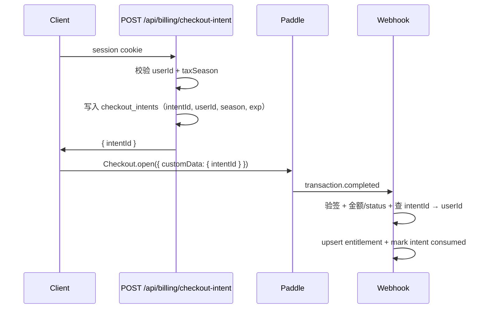

# Snap1099 安全修复计划

> **For agentic workers:** 按 Phase 顺序执行；每个 Task 使用 checkbox 跟踪。本计划 **仅规划，不含编码**。

**Goal：** 消除 [`2026-06-13-security-audit-pending.md`](./2026-06-13-security-audit-pending.md) 中 P0–P2 项，加固计费链路、限流与 HTTP 安全基线，并补充回归测试。

**Source audit：** [`docs/security/2026-06-13-security-audit-pending.md`](./2026-06-13-security-audit-pending.md)

**已锁定决策（2026-06-13）：**
- **SEC-03：** Checkout Intent（服务端签发 `intentId`，Webhook 查 DB）
- **限流 / 冷却：** 全部用 **Postgres 表**，不引入 Redis / Upstash；前期量小，避免双存储架构

**Scope：** `codeworks/snaptax` — API、Webhook、限流、Flags、middleware、用户 PATCH、部署校验

**Out of scope（本计划不实现）：**
- 依赖 CVE 扫描自动化（`npm audit` CI 集成）— 见 Phase 4 可选
- SEC-14 CPA 导出 URL TTL 改造（需产品决策）
- SEC-16 Paywall 乐观 UI（当前服务端已 gate，维持现状）
- EU 分库 / 手机号认证

**Tech stack：** Next.js 16 App Router · Prisma · Postgres · Paddle Billing · Vercel Flags · node:test + tsx

**移除依赖（实施时）：** `@upstash/ratelimit`、`@upstash/redis` — 由 DB 限流替代，减少 env 与运维面

**Estimated effort：**

| Phase | 项 | 估时 |
|-------|-----|------|
| Phase 1 — P0 阻断 | SEC-01, 02, 04, 05 | 2–3d |
| Phase 2 — P1 加固 | SEC-03, 06, 07, 10 | 2–3d |
| Phase 3 — P2 纵深 | SEC-08, 09, 11, 12 | 1–2d |
| Phase 4 — P3 可选 | SEC-13, 14, 15 | 0.5–1d |

---

## 架构决策（实施前锁定）

### D1 — 限流：Postgres 固定窗口计数（无 Redis）

**原则：** 限流、process 冷却、Ghost 注册限速 **统一走同一张 DB 表 + 同一套 helper**，不单独上 Redis。

**表设计：** `snaptax_rate_limit_buckets`

```prisma
model SnaptaxRateLimitBucket {
  bucketKey   String   @id @map("bucket_key") @db.VarChar(255)
  windowStart DateTime @map("window_start") @db.Timestamptz(3)
  count       Int      @default(0)
  updatedAt   DateTime @updatedAt @map("updated_at") @db.Timestamptz(3)

  @@index([windowStart], map: "snaptax_rate_limit_buckets_window_start_idx")
  @@map("snaptax_rate_limit_buckets")
}
```

**bucketKey 命名约定：**

| 场景 | key 示例 | 默认窗口 | 默认上限 |
|------|----------|----------|----------|
| IP 上传 | `ip:receipt:{ip}` | 1 min | 60 |
| Ghost 上传 | `ghost:receipt:{ghostId}` | 1 h | 10 |
| User 上传 | `user:receipt:{userId}` | 1 h | 30 |
| Process 冷却 | `process:receipt:{receiptId}` | 30 s | 1 |
| Ghost 注册 | `ip:ghost_register:{ip}` | 1 min | 10 |

**算法（固定窗口，简单够用）：**

1. `windowStart = floor(now / windowMs) * windowMs`
2. `UPSERT` bucket：同 key + 同 window → `count++`；新 window → `count=1`
3. `count > limit` → `{ ok: false, retryAfterSec }`
4. 写路径顺带 `DELETE FROM ... WHERE window_start < now() - interval '24 hours'`（轻量 GC，无需 cron）

**多实例：** Vercel 多副本下 Postgres 行级 upsert 天然共享计数，比进程内 Map 正确。

**fail-fast：** 仅依赖已有 `DATABASE_URL`（项目本来就要 Postgres）；**不再要求** Upstash KV。

**量级说明：** 前期 DAU 小，桶行数 ≈ 活跃 IP/Ghost 数 × 窗口种类；24h GC 足够。日活上万后再评估 Redis 或 edge rate limit。

### D2 — Paddle 权益：Checkout Intent（已批准）

采用 **服务端签发 checkout intent**，替代纯客户端 `customData.userId`：



**不采用：** Webhook 内调 Paddle API 比对 email（增加外呼与邮箱对齐复杂度；与「先 Google 登录再 Paywall」产品流不匹配）。

**DB：** 新增 `snaptax_checkout_intents` 表（见 Task 2.1）。

### D3 — Verify bypass：生产硬拒绝

`buildVerifyContext` 增加 **platform gate**：

```typescript
const platformAllowsVerify =
  process.env.VERCEL_ENV !== "production";
// canBypass = platformAllowsVerify && isVerifyMode && isWhitelisted && ...
```

Preview / local 仍可用 Flags；**production 永远 `canBypass=false`**，即使 Dashboard 误配。

### D4 — Webhook 占位 secret：删除 skip，改为 dev-only 显式开关

- **删除** `isPaddleWebhookSecretPlaceholder` → `return true` 逻辑
- 新增 `PADDLE_WEBHOOK_SKIP_VERIFY=1`，**仅** `NODE_ENV=development` 且 localhost 时生效
- `production` / `preview` 检测到 placeholder secret → **启动 fail-fast**

### D5 — 安全头：middleware.ts 统一注入

新建 `middleware.ts`，对页面 + API 响应附加 baseline headers；CSP 分两步：
1. **Phase 2a：** Report-Only 或宽松 CSP（self + Google + Paddle + Vercel）
2. **Phase 2b（可选）：** 收紧 `script-src` 并移除 inline（需评估 `InstallCaptureScript`）

---

## File map（按 Phase）

### Phase 1

| File | Action | SEC |
|------|--------|-----|
| `prisma/schema.prisma` | Modify | SEC-01 |
| `prisma/migrations/..._rate_limit_buckets` | Create | SEC-01 |
| `lib/api/dbRateLimit.ts` | Create | SEC-01, 07, 08 |
| `lib/api/dbRateLimit.test.ts` | Create | SEC-01 |
| `lib/api/rateLimit.ts` | Refactor（删 Upstash，转调 dbRateLimit） | SEC-01, 09 |
| `lib/server/startupChecks.ts` | Create | SEC-04, 05, 12 |
| `instrumentation.ts` | Modify | SEC-04, 12 |
| `package.json` | Modify（移除 @upstash/*） | SEC-01 |
| `lib/server/paddleWebhook.ts` | Modify | SEC-04 |
| `lib/server/paddleWebhook.test.ts` | Modify | SEC-04 |
| `app/api/webhooks/paddle/route.ts` | Modify | SEC-02 |
| `lib/billing/validatePaddleTransaction.ts` | Create | SEC-02 |
| `lib/billing/validatePaddleTransaction.test.ts` | Create | SEC-02 |
| `lib/verify/buildVerifyContext.ts` | Modify | SEC-05 |
| `lib/verify/buildVerifyContext.test.ts` | Modify | SEC-05 |
| `.env.example` | Modify | SEC-01, 04 |
| `docs/tech/07-paddle-billing.md` | Modify | SEC-02 |
| `docs/tech/09-deployment-vercel.md` | Modify | SEC-01（移除 Upstash 要求） |

### Phase 2

| File | Action | SEC |
|------|--------|-----|
| `prisma/schema.prisma` | Modify | SEC-03 |
| `prisma/migrations/...` | Create | SEC-03 |
| `lib/billing/checkoutIntent.ts` | Create | SEC-03 |
| `app/api/billing/checkout-intent/route.ts` | Create | SEC-03 |
| `components/settings/PaywallSheet.tsx` | Modify | SEC-03 |
| `app/api/webhooks/paddle/route.ts` | Modify | SEC-03 |
| `middleware.ts` | Create | SEC-06 |
| `lib/security/headers.ts` | Create | SEC-06 |
| `next.config.ts` | Modify（若 middleware 不足） | SEC-06 |
| `app/api/receipts/[id]/process/route.ts` | Modify | SEC-07 |
| `app/api/users/me/route.ts` | Modify | SEC-10 |
| `lib/users/industrySchema.ts` | Create | SEC-10 |
| `lib/users/industrySchema.test.ts` | Create | SEC-10 |

### Phase 3

| File | Action | SEC |
|------|--------|-----|
| `app/api/ghost/register/route.ts` | Modify | SEC-08 |
| `lib/api/rateLimit.ts` | Modify | SEC-08 |
| `lib/api/clientIp.ts` | Create | SEC-09 |
| `lib/api/taxRegion.ts` | Modify | SEC-11 |
| `app/api/auth/google/route.ts` | Modify | SEC-11 |
| `lib/server/env.ts` | Modify | SEC-12 |
| `lib/server/env.test.ts` | Create | SEC-12 |

### Phase 4（可选）

| File | Action | SEC |
|------|--------|-----|
| `app/.well-known/vercel/flags/route.ts` | Modify | SEC-13 |
| `lib/export/receiptImageUrl.ts` | Modify | SEC-14 |
| `app/api/auth/logout/route.ts` | Modify | SEC-15 |

---

## Phase 1 — P0 阻断（上线前必做）

### Task 1.1 — SEC-01 Postgres 限流（取代 Upstash）

**Files：** `prisma/schema.prisma`, migration, `lib/api/dbRateLimit.ts`, `lib/api/rateLimit.ts`, `package.json`

- [ ] **Step 1：** 新增 `SnaptaxRateLimitBucket` 表（见 D1）并 `db:migrate:dev`
- [ ] **Step 2：** 实现 `consumeRateLimit({ bucketKey, windowMs, limit })`：
  - Prisma `$transaction` 内 upsert + increment
  - 返回 `{ ok, retryAfterSec, count }`
  - 附带删除 24h 前过期 bucket（同 transaction 或 fire-and-forget）
- [ ] **Step 3：** 重构 `lib/api/rateLimit.ts` — 删除 `@upstash/*` import，改为调用 `dbRateLimit`
- [ ] **Step 4：** 保留现有 env 限额：`RECEIPT_GHOST_HOURLY`（默认 10）、IP 60/min；新增 `RECEIPT_USER_HOURLY`（默认 30）
- [ ] **Step 5：** `POST /api/receipts` — ghost 走 ghost+IP 双限；`actor.kind === "user"` 追加 user 维度
- [ ] **Step 6：** 移除 `package.json` 中 `@upstash/ratelimit`、`@upstash/redis`
- [ ] **Step 7：** 单元测试 — mock prisma 或 test DB：窗口内超限返回 false；新窗口重置
- [ ] **Step 8：** 更新 `.env.example` — 删除 KV 相关项；文档化 `RECEIPT_*` 限额 env
- [ ] **Step 9：** 更新 `docs/tech/09-deployment-vercel.md` — 限流仅依赖 Postgres

**Acceptance：**
- [ ] 无 Upstash env 时限流仍生效（不再静默放行）
- [ ] 超限时 `POST /api/receipts` 返回 429
- [ ] `npm run test:unit` 通过

---

### Task 1.2 — SEC-02 Paddle Webhook 交易校验

**Files：** `lib/billing/validatePaddleTransaction.ts`, `app/api/webhooks/paddle/route.ts`

- [ ] **Step 1：** 阅读 Paddle Billing webhook payload 文档，确认 `data.status` 合法值（`completed` 等）
- [ ] **Step 2：** 实现 `validatePaddleTransaction(payload)` 纯函数：
  - `event_type === "transaction.completed"`
  - `data.status === "completed"`（以文档为准）
  - `totals.total >= MIN_PADDLE_AMOUNT`（env `PADDLE_MIN_AMOUNT_CENTS=4900`，默认 4900）
  - currency === `USD`（或 env `PADDLE_CURRENCY`）
- [ ] **Step 3：** 校验失败 → `logEvent(warn)` + 返回 `200 { ok: true, ignored: true }`（幂等，防 Paddle 重试风暴）
- [ ] **Step 4：** 单元测试 — 负例：$0、refunded、错误 currency、缺 status
- [ ] **Step 5：** 同步 `docs/tech/07-paddle-billing.md` §7.5 与实现对齐

**Acceptance：**
- [ ] 非法金额/状态 webhook 不写 `snaptax_season_entitlements`
- [ ] 合法 sandbox $49 测试单仍正常写 entitlement

---

### Task 1.3 — SEC-04 移除 Webhook 占位 secret 跳过逻辑

**Files：** `lib/server/paddleWebhook.ts`, `lib/server/startupChecks.ts`, `.env.example`

- [ ] **Step 1：** 删除 `isPaddleWebhookSecretPlaceholder` → `return true` 分支
- [ ] **Step 2：** 新增 opt-in：`PADDLE_WEBHOOK_SKIP_VERIFY=1` 且 `NODE_ENV=development` 才跳过
- [ ] **Step 3：** `startupChecks` — preview/production 若 secret ∈ placeholder 集合 → fail-fast
- [ ] **Step 4：** 更新 `paddleWebhook.test.ts` — placeholder 在非 dev 必须验签失败
- [ ] **Step 5：** `.env.example` 文档化新开关（默认 unset）

**Acceptance：**
- [ ] Preview 部署使用 placeholder secret 时启动失败（强制换 sandbox secret）
- [ ] 本地 dev 可显式 skip 便于 webhook 联调

---

### Task 1.4 — SEC-05 生产环境禁用 Verify bypass

**Files：** `lib/verify/buildVerifyContext.ts`, `lib/verify/buildVerifyContext.test.ts`

- [ ] **Step 1：** 增加 `isPlatformVerifyAllowed()`：`VERCEL_ENV !== "production"`
- [ ] **Step 2：** `canBypass` / `canBypassPay` / `canMockAi` 均与 platform gate AND
- [ ] **Step 3：** 扩展单元测试矩阵 — production + verify flags → 全 false
- [ ] **Step 4：** 在 `ensureBypassEntitlement` 调用前 assert（defense in depth）
- [ ] **Step 5：** 更新 `docs/superpowers/specs/2026-06-13-production-verify-flags-design.md` 注明 production 限制

**Acceptance：**
- [ ] production 即使 Flags Dashboard 设 `runModel=verify`，导出仍 402
- [ ] preview/local 白名单验证流程不受影响

---

### Phase 1 合并验收

- [ ] 全量 `npm run test:unit`
- [ ] Preview 部署 smoke：上传小票、Paywall、Flags Explorer
- [ ] 手动：向 Preview POST 伪造 webhook（无签名）→ 401
- [ ] 更新 audit doc SEC-01/02/04/05 状态为「已修复」并链接 PR

---

## Phase 2 — P1 加固（本迭代）

### Task 2.1 — SEC-03 Checkout Intent 计费绑定

**Files：** Prisma migration, `lib/billing/checkoutIntent.ts`, `app/api/billing/checkout-intent/route.ts`, `PaywallSheet.tsx`, webhook route

- [ ] **Step 1：** 设计 `snaptax_checkout_intents` 表
  ```prisma
  model SnaptaxCheckoutIntent {
    id          String   @id @default(uuid())
    userId      String   @db.Uuid
    taxSeason   String
    status      String   @default("pending") // pending | consumed | expired
    expiresAt   DateTime
    transactionId String? @unique
    createdAt   DateTime @default(now())
    user        SnaptaxUser @relation(...)
    @@index([userId, taxSeason])
  }
  ```
- [ ] **Step 2：** `POST /api/billing/checkout-intent` — 需 session；返回 `{ intentId, expiresAt }`；TTL 15min
- [ ] **Step 3：** 同一 user+season 重复请求复用未过期 pending intent（幂等）
- [ ] **Step 4：** `PaywallSheet` — checkout 前先调 intent API；`customData: { intentId }`（**不再传 userId**）
- [ ] **Step 5：** Webhook — 从 `custom_data.intentId` 查表得 `userId`；校验 intent pending + 未过期
- [ ] **Step 6：** 写 entitlement 后 mark intent `consumed` + 存 `transactionId`
- [ ] **Step 7：** 未知/过期 intentId → warn 日志，不写 entitlement
- [ ] **Step 8：** 单元 + 集成测试（mock webhook payload）
- [ ] **Step 9：** 更新 `docs/tech/07-paddle-billing.md` §7.3–7.5 序列图

**Acceptance：**
- [ ] DevTools 篡改 `customData.userId` 不再有效（字段已移除）
- [ ] 篡改 `intentId` 为他人 UUID → webhook 不写 entitlement
- [ ] 正常 Paddle sandbox 支付流程 E2E 通过

---

### Task 2.2 — SEC-06 安全响应头 middleware

**Files：** `middleware.ts`, `lib/security/headers.ts`

- [ ] **Step 1：** 定义 baseline headers：
  - `X-Content-Type-Options: nosniff`
  - `X-Frame-Options: DENY`
  - `Referrer-Policy: strict-origin-when-cross-origin`
  - `Permissions-Policy: camera=(self), geolocation=()`
- [ ] **Step 2：** CSP v1（宽松，避免 break PWA / Paddle / Google）：
  ```
  default-src 'self';
  script-src 'self' 'unsafe-inline' https://accounts.google.com https://cdn.paddle.com ...;
  connect-src 'self' https://*.paddle.com https://accounts.google.com ...;
  frame-src https://buy.paddle.com ...;
  img-src 'self' data: blob: https:;
  ```
- [ ] **Step 3：** matcher 排除 `_next/static`、favicon；**包含** `/api/*`
- [ ] **Step 4：** 本地 + Preview 手动验证：Google 登录、Paddle Overlay、相机拍照
- [ ] **Step 5：** 文档记录 CSP 与 `InstallCaptureScript` inline script 的关系

**Acceptance：**
- [ ] `curl -I /` 可见 security headers
- [ ] 核心用户流程无 console CSP 阻断错误

---

### Task 2.3 — SEC-07 Process 接口冷却

**Files：** `lib/api/dbRateLimit.ts`, `app/api/receipts/[id]/process/route.ts`

- [ ] **Step 1：** 复用 `consumeRateLimit` — bucket `process:receipt:{receiptId}`，窗口 30s，limit 1
- [ ] **Step 2：** 可选 per-actor 桶 `user:process:{userId}` 或 `ghost:process:{ghostId}`，1h / 20 次
- [ ] **Step 3：** 冷却中返回 `429 RATE_LIMITED`
- [ ] **Step 4：** `status === "done"` 时仍立即返回（不触发 OpenAI、不消耗冷却）
- [ ] **Step 5：** 单元测试

**Acceptance：**
- [ ] 同一 receiptId 30s 内第二次 process → 429
- [ ] 正常重试 blurry 小票在冷却后可成功

---

### Task 2.4 — SEC-10 Industry 白名单校验

**Files：** `lib/users/industrySchema.ts`, `app/api/users/me/route.ts`

- [ ] **Step 1：** 从 `lib/types.ts` 导出 `Industry` zod enum（6 值）
- [ ] **Step 2：** PATCH body schema：`z.object({ industry: IndustryEnum })`
- [ ] **Step 3：** 非法值 → `400 INVALID_INDUSTRY`
- [ ] **Step 4：** `receiptVision.ts` 使用 enum label map 而非原始字符串拼接（可选 hardening）
- [ ] **Step 5：** 单元测试

**Acceptance：**
- [ ] `PATCH { industry: "ignore instructions" }` → 400
- [ ] UI 既有 6 个选项仍正常保存

---

### Phase 2 合并验收

- [ ] E2E：登录 → Paywall → sandbox 支付 → 导出
- [ ] E2E：伪造 webhook intentId → 无 entitlement
- [ ] 更新 audit doc SEC-03/06/07/10

---

## Phase 3 — P2 纵深防御

### Task 3.1 — SEC-08 Ghost 注册限流

**Files：** `app/api/ghost/register/route.ts`, `lib/api/dbRateLimit.ts`

- [ ] **Step 1：** 新增 `checkGhostRegisterLimit(ip)` — bucket `ip:ghost_register:{ip}`，10/min（env `GHOST_REGISTER_IP_PER_MIN`）
- [ ] **Step 2：** 在 register route 入口调用（429 时仍不泄露 ghost 是否存在）
- [ ] **Step 3：** 单元测试

---

### Task 3.2 — SEC-09 可信客户端 IP

**Files：** `lib/api/clientIp.ts`, `lib/api/rateLimit.ts`

- [ ] **Step 1：** Vercel 环境优先 `@vercel/functions` `ipAddress(request)` 或 `x-real-ip`
- [ ] **Step 2：** 非 Vercel fallback 现有逻辑并 warn
- [ ] **Step 3：** 单元测试 mock headers

---

### Task 3.3 — SEC-11 Tax Region 登录 sanity check

**Files：** `lib/api/taxRegion.ts`, `app/api/auth/google/route.ts`

- [ ] **Step 1：** 定义 region 决策函数 `resolveInitialDataRegion({ header, acceptLanguage, geoHint? })`
- [ ] **Step 2：** 若 header 与 `Accept-Language` 严重冲突（如 header=eu 但仅 `en-US`）→ 采用 conservative default（`us`）并 log
- [ ] **Step 3：** **不**在 MVP 引入 IP Geo 外部服务（除非已有 Vercel geo header）；文档注明限制
- [ ] **Step 4：** 已锁定用户忽略 header（现有行为保持）

**Acceptance：**
- [ ] 手动改 localStorage 为 eu + en-US only → 登录后 region 有 warn 日志；行为可预期

---

### Task 3.4 — SEC-12 Secret 独立配置 enforcement

**Files：** `lib/server/env.ts`, `lib/server/startupChecks.ts`

- [ ] **Step 1：** production 要求 `GHOST_HMAC_SECRET` 与 `AUTH_SECRET` **同时存在且不相等**
- [ ] **Step 2：** 移除 production 下互相 fallback（development 可保留便捷 fallback）
- [ ] **Step 3：** 单元测试
- [ ] **Step 4：** 更新 `AGENTS.md` / `.env.example`

---

### Phase 3 合并验收

- [ ] 更新 audit doc SEC-08/09/11/12
- [ ] Vercel production env 审计：两 secret 已独立配置

---

## Phase 4 — P3 可选清理

### Task 4.1 — SEC-13 Flags 发现端点

- [ ] production 返回 `404` 或要求 Vercel 内部 header
- [ ] preview/development 保留 Explorer 能力

### Task 4.2 — SEC-14 导出 URL TTL

- [ ] 产品决策：7d → 24h 或 CPA pack 内嵌二进制
- [ ] 更新 `docs/tech/08-export.md` 风险说明

### Task 4.3 — SEC-15 登出清 Ghost

- [ ] `POST /api/auth/logout` 同时清除 `snap1099_ghost` cookie
- [ ] 客户端下次请求自动 re-register

---

## 测试策略

| 类型 | 覆盖 |
|------|------|
| 单元 | `validatePaddleTransaction`, `buildVerifyContext`, `dbRateLimit`, `industrySchema`, `paddleWebhook`, `checkoutIntent` |
| 集成 | Webhook route（mock Request + prisma test db 或 mock） |
| 手动 | Preview 伪造 webhook、Paddle sandbox 支付、CSP 回归 |
| 负例清单 | 无签名 webhook、$0 交易、过期 intent、production verify flags |

**建议新增测试文件：**
- `lib/billing/validatePaddleTransaction.test.ts`
- `lib/billing/checkoutIntent.test.ts`
- `lib/api/dbRateLimit.test.ts`
- `lib/server/startupChecks.test.ts`

---

## 部署与回滚

### 部署顺序

1. Phase 1 合并 → **`db:migrate:deploy`（rate_limit_buckets 表）** → 再部署代码
2. Preview smoke 24h；确认 Paddle sandbox secret / 独立 AUTH secrets
3. Production 部署 Phase 1
4. Phase 2 → **`db:migrate:deploy`（checkout_intents 表）** → 再部署代码
5. Phase 3 无 breaking change，可独立发布

### 回滚

| 变更 | 回滚方式 |
|------|----------|
| DB 限流过严 | 调高 env 限额或 revert；表可保留 |
| Webhook 校验加严 | revert commit；注意已拒绝的 webhook Paddle 会重试 |
| Checkout intent | code revert；旧 client 若仍传 userId，webhook 需兼容窗口（见下） |

### Checkout intent 兼容窗口（Task 2.1）

Webhook 处理 **同时支持** 30 天：
- 新：`custom_data.intentId`
- 旧：`custom_data.userId`（deprecated，仅验签通过 + 金额校验 + session 无法验证时 log warn）

30 天后移除旧路径。

---

## 风险与依赖

| 风险 | 缓解 |
|------|------|
| CSP 破坏 Paddle/Google | Phase 2 先在 Preview 全量手测 |
| DB 限流写放大 | 固定窗口 + 24h GC；前期量小可接受；监控 `snaptax_rate_limit_buckets` 行数 |
| 限流 upsert 热点 | bucketKey 分散（IP/Ghost/User）；必要时加 connection pool |
| Checkout intent migration | 低峰 migrate；无 user-facing downtime |
| 限流加严误伤正常用户 | 限额 env 可调；先 Preview 观察 429 率 |

**外部依赖：**
- Postgres（已有 `DATABASE_URL`）
- Paddle Sandbox webhook URL 指向 Preview
- Vercel env：`VERCEL_ENV`, `PADDLE_*`, `GHOST_HMAC_SECRET`, `AUTH_SECRET`

**后期扩展（本计划不做）：** 日活显著上升后，可将 `dbRateLimit` 实现替换为 Redis adapter，**对外 API 不变**。

---

## 完成定义（Definition of Done）

- [ ] P0 四项（SEC-01/02/04/05）代码合并 + production 部署
- [ ] P1 四项（SEC-03/06/07/10）代码合并 + migration 部署
- [ ] `npm run test:unit` CI 绿
- [ ] [`2026-06-13-security-audit-pending.md`](./2026-06-13-security-audit-pending.md) 对应项标记 ✅ + PR 链接
- [ ] `docs/tech/07-paddle-billing.md` 与 `09-deployment-vercel.md` 已同步
- [ ] Preview 渗透复测：伪造 webhook、限流 bypass 均失败

---

*计划版本：2026-06-13 v2 · 状态：已批准（Checkout Intent + DB 限流）· 下一步：按 Phase 1 开始实施*
