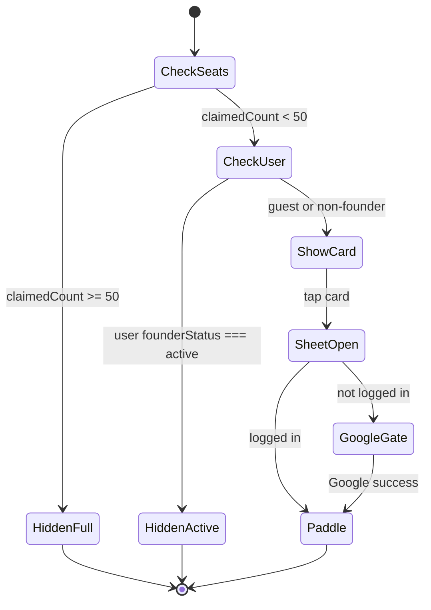
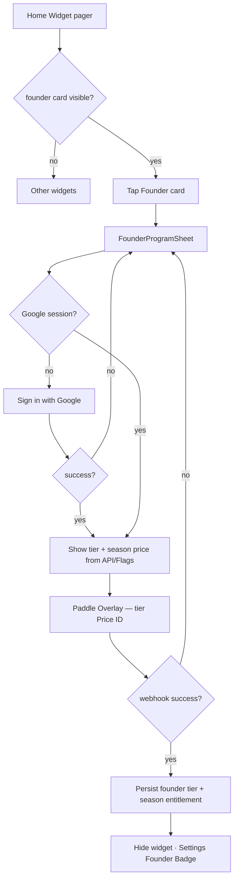

# Founder Program Widget — Design

**Date:** 2026-06-30  
**Status:** Approved (design)  
**References:** `docs/prd/marketing-0.0.1.md` · mockup (crown + NEW + amber card)  
**Scope:** Home Widget #1 · FounderProgramSheet · Settings Badge · `GET /api/founder/program` · Paddle SKU/Flag · founder entitlement persistence

## Summary

Add a **Founder Program** marketing card as the **first** slide in the Home Widget pager (below Snap). Tapping opens a **bottom sheet** (LegalSheet pattern, not a core-flow Modal). Purchase is **per tax season** (not monthly subscription); price and SKU tier come from **Vercel Flags + Paddle Price IDs**, not hardcoded `$49`. First 50 Google-authenticated buyers lock a **lifetime tier price** for future seasons; seat #51+ or lapsed founders pay **DEFAULT** season price.

## PRD divergence (marketing-0.0.1.md)

| marketing PRD | This design |
|---------------|-------------|
| `$X/month` subscription | **One-time per tax season** SKU |
| Large dedicated section (§6) | **Widget card #1** + Sheet |
| Static tier copy | **Flag-driven** display price per tier |
| Implied always-on subscription | **Season entitlement** + founder tier lock on user record |

PRODUCT-SPEC §6 Paywall remains “按报税季”; this spec **SKU-ifies** pricing and adds founder tiers without changing core Snap zero-Modal rule.

## Locked decisions

| Topic | Choice |
|-------|--------|
| Billing model | Per **tax season**; pay once → **unlimited Export that season** |
| Price source | **No hardcode $49**; amount from **Flag + Paddle Price ID** per SKU |
| SKU tiers | `FOUNDER_LEVEL_SUPER` (#1–10) · `EARLY` (#11–30) · `FOUNDER` (#31–50) · `DEFAULT` (#51+ / forfeit) |
| Lifetime lock | **Option C:** first purchase locks tier; each season renews **same tier price** via dedicated Flag + Paddle price; cancel/lapse → re-buy at **DEFAULT** only |
| Widget position | **`founder` fixed index 0** in `buildWidgetPageKeys` (prepend before existing keys) |
| Hide card | `claimedCount ≥ 50` → hidden for **everyone**; user already **Founder Active** → hidden (Badge in Settings only) |
| Gate | **Become Founder requires Google login** (hard gate before Paddle) |
| Interaction | Tap card → **FounderProgramSheet** → Google (if needed) → Paddle Overlay |
| API | **`GET /api/founder/program`**: `claimedCount`, `seatsTotal=50`, user founder status, Flag prices per tier |
| NEW badge | Dismiss on **first view** via `localStorage`; card remains tappable |
| Export | Active Founder **or** paid current-season SKU → Export included (align with existing season entitlement) |

## Visibility state machine



## User flow



## Widget UI

### Placement

- Insert `founder` as first key in `lib/home/buildWidgetPages.ts` → `buildWidgetPageKeys`.
- Render in `components/home/widgets/WidgetPager.tsx` via new `FounderProgramWidget`.

### Visual (mockup-aligned)

- Amber/yellow accent card (`#EAB308` family); black/white typography per product palette.
- **Crown** icon + **`NEW`** pill (until local dismiss).
- Title: **Founder Program**
- Subtitle: **Be one of the first 50 founders**
- Trailing: **View ›** (or chevron)
- Min touch target ≥64px; `active:scale-95`.

### NEW badge persistence

- Key: e.g. `snaptax_founder_widget_seen` in `localStorage` (or extend existing onboarding storage pattern).
- Set on first mount when card is visible; do not block interaction.

## FounderProgramSheet

- Pattern: `LegalSheet` / `PaywallSheet` — bottom sheet, **not** blocking Snap flow.
- Content:
  - Tier name + locked benefit copy (from marketing PRD, shortened)
  - **Current season price** (Flag-resolved, formatted USD)
  - Seats remaining: `50 - claimedCount` (cap display at 0)
  - **Become Founder** CTA → Google gate → Paddle
  - Legal/links as needed (Terms reference season SKU, not subscription)
- If user already entitled this season via non-founder SKU, sheet explains status (no double charge).

## Settings — Founder Badge

Per marketing PRD §10: when `founderStatus === active`, show badge in Settings account/summary area (not on Home widget). Copy TBD in implementation plan; include tier label (Super / Early / Founder).

## API: `GET /api/founder/program`

**Auth:** optional — Ghost may read public seat count; user-specific fields require session.

**Response (example shape):**

```json
{
  "seatsTotal": 50,
  "claimedCount": 12,
  "remaining": 38,
  "programOpen": true,
  "tiers": {
    "FOUNDER_LEVEL_SUPER": { "seatRange": [1, 10], "priceCents": null, "paddlePriceId": null },
    "EARLY": { "seatRange": [11, 30], "priceCents": null, "paddlePriceId": null },
    "FOUNDER": { "seatRange": [31, 50], "priceCents": null, "paddlePriceId": null },
    "DEFAULT": { "seatRange": null, "priceCents": null, "paddlePriceId": null }
  },
  "user": {
    "founderStatus": "none | active | lapsed",
    "founderTier": "FOUNDER_LEVEL_SUPER | EARLY | FOUNDER | null",
    "founderNumber": null,
    "currentSeasonEntitled": false
  }
}
```

- `priceCents` / `paddlePriceId` populated server-side from Flags + env (never trust client).
- `claimedCount` = count of users with assigned `founder_number` 1–50 (atomic assign on first qualifying purchase).

## SKU, Flags, and Paddle

### Tier assignment (first purchase)

1. User completes Google login.
2. Paddle checkout uses **Price ID for tier implied by next seat** (`claimedCount + 1`).
3. Webhook: atomically increment assign `founder_number`, set `founder_tier`, grant season entitlement.
4. Race at seat 50: server transaction — only one #50 winner; #51 gets DEFAULT flow (widget hidden after 50 claimed).

### Season renewal

- Active founder: checkout uses **locked tier** Flag price + Paddle Price ID (not DEFAULT).
- Lapsed / cancelled founder: **DEFAULT** only; `founder_tier` retained for analytics/history but not pricing.

### Flags (names illustrative — implement in Vercel Flags)

| Flag | Purpose |
|------|---------|
| `founder_program_enabled` | Kill switch |
| `founder_price_super_cents` | Super tier season price |
| `founder_price_early_cents` | Early tier season price |
| `founder_price_founder_cents` | Founder tier season price |
| `founder_price_default_cents` | DEFAULT season price (replaces hardcoded $49 in Paywall path over time) |

Paddle Price IDs remain in env (`PADDLE_*`) mapped per tier in server config.

### Webhook extensions

- Extend `app/api/webhooks/paddle/route.ts` to recognize founder SKUs / custom_data tier marker.
- Upsert `snaptax_season_entitlements` + user founder columns (new migration).

## Data model (product-level)

Extend `snaptax_users` (or dedicated `snaptax_founder_members`):

| Field | Notes |
|-------|-------|
| `founder_number` | 1–50 or null |
| `founder_tier` | enum SKU tier |
| `founder_locked_at` | first purchase timestamp |
| `founder_status` | `active` / `lapsed` / null |

Reuse `snaptax_season_entitlements` for per-season Export rights.

## Analytics (marketing PRD §14)

| Event | When |
|-------|------|
| `founder_widget_impression` | Card visible in pager |
| `founder_widget_tap` | Open sheet |
| `founder_sheet_view` | Sheet opened |
| `founder_google_gate` | Prompted Google |
| `founder_checkout_start` | Paddle opened |
| `founder_purchase_success` | Webhook confirmed |
| `founder_purchase_fail` | Paddle/error |

Include `tier`, `founder_number`, `claimedCount` where available.

## Non-goals (this phase)

- Monthly subscription billing
- Phone auth for founder purchase
- Core Snap Modal for founder CTA
- Promising “cloud sync” without Google login
- Showing widget after 50 seats or for active founders

## Files (implementation touch list)

| Area | Path |
|------|------|
| Widget order | `lib/home/buildWidgetPages.ts` |
| Pager | `components/home/widgets/WidgetPager.tsx` |
| New UI | `components/home/widgets/FounderProgramWidget.tsx`, `components/home/sheets/FounderProgramSheet.tsx` |
| Settings badge | `components/settings/*` (account/summary) |
| API | `app/api/founder/program/route.ts` |
| Billing | `lib/billing/*`, `app/api/webhooks/paddle/route.ts` |
| Flags | new `flags/founder.ts` (or extend provider) |
| DB | Prisma migration for founder fields |
| Tests | API seat assignment race, visibility rules, Flag price resolution |

## Accessibility

- Widget card: focusable, `aria-label` describing program + seats remaining.
- Sheet: focus trap, Esc dismiss, 44px+ targets.
- NEW badge: decorative or `aria-hidden` if redundant with title.

## Spec self-review

| Check | Result |
|-------|--------|
| Core Snap zero Modal | ✅ Sheet only |
| Google-only auth for purchase | ✅ |
| Offline PWA | ✅ Widget hidden or stale count OK; purchase requires network |
| PRODUCT-SPEC colors/touch | ✅ |
| Paywall Paddle Overlay | ✅ Same as PaywallSheet |
| No hardcoded $49 | ✅ Flag + Price ID |
| Export entitlement | ✅ Season SKU + founder renewal |
| 50-seat cap | ✅ API + hide widget |
| PRD §14 events listed | ✅ |

## Open for implementation plan

- Exact Flag keys and env var naming convention with existing `PADDLE_*` aliases.
- Copy strings i18n (EN first; fr/de/es parity with legal pattern).
- Whether Ghost sees “Sign in to become Founder” vs hidden CTA until login attempt.
- Migration backfill for existing season purchasers (DEFAULT tier, no founder number).

---

**Next:** User review → `writing-plans` for phased implementation (UI slice vs API/Paddle/DB).
