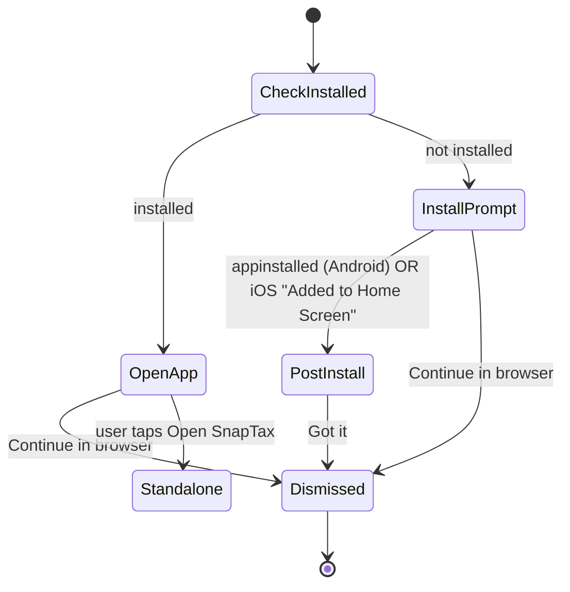

# PWA SnapTax Label + `/app` Mobile Browser Entry Gate — Design

**Date:** 2026-07-06  
**Status:** Approved (brainstorming + grill-me)  
**Scope:** (1) Rename installed home-screen icon label to **SnapTax**; (2) full-screen entry gate on `/app` for mobile browser users (Android Chrome + iOS Safari).

**References:** `app/manifest.ts` · `2026-06-10-pwa-install-prompt-design.md` · `2026-06-19-android-webapk-hyperos-launch-design.md` · `2026-06-10-pwa-cross-context-installed-design.md`

---

## Locked decisions (grill-me)

| # | Topic | Decision |
|---|-------|----------|
| 1 | Gate strictness | **Skippable** — primary CTA + **Continue in browser** |
| 2 | Icon label | **SnapTax** (`manifest.short_name`, iOS `appleWebApp.title`) |
| 3 | vs Landing | Gate shows **after** `LandingGate` completes |
| 4 | Already installed (browser tab) | Full-screen **Open SnapTax** — **user tap required** (no auto redirect) |
| 5 | Gate dismiss persistence | **`sessionStorage`** — no full-screen gate again same session |
| 6 | Post-install UX | **In-gate state** — no separate `WebApkLaunchGuideSheet` when gate is active |
| 7 | Android browsers | Full-screen gate **Android Chrome only**; Edge/Firefox/etc. keep existing install bar |
| 8 | Devices | **Phone + iPad** (`ios-safari` + Android Chrome) |
| 9 | After gate skip | Hide **bottom install bar** this session; keep **header install button** |
| 10 | iOS install detection | Manual path ends with **Added to Home Screen** button → post-install in-gate state |
| 11 | Route scope | **`/app` only** — marketing pages unchanged |

---

## Part 1 — SnapTax icon label

### Problem

Installed PWA home-screen label shows **Snap1099** from manifest/meta. Product domain/branding uses **SnapTax**.

### Change (display only)

| File | Field | Before | After |
|------|-------|--------|-------|
| `app/manifest.ts` | `name`, `short_name` | Snap1099 | **SnapTax** |
| `app/layout.tsx` | `applicationName`, `appleWebApp.title` | Snap1099 | **SnapTax** |
| `app/(pwa)/app/layout.tsx` | `metadata.title` | Snap1099 | **SnapTax** |

### Out of scope

- localStorage / sessionStorage keys (`snap1099_pwa_*`)
- Window globals (`__snap1099*`)
- i18n product copy (still Snap1099 in UI strings)
- Cookie / IndexedDB prefixes

### Caveat

Existing installs **do not** relabel until user reinstalls or re-adds to home screen (OS behavior).

---

## Part 2 — `/app` mobile browser entry gate

### Problem

User opens `https://snaptax.lightxforge.com/app` in a **mobile browser tab** (not standalone):

- If PWA **installed** → should be guided into standalone (Android Chrome via user-gesture navigation; iOS via home-screen hint).
- If PWA **not installed** → should be prompted to install, then guided to open from home screen.

Current behavior: install bar / hints only; no unified entry gate on `/app`.

### Eligibility (`shouldShowAppBrowserEntryGate`)

All must be true:

1. Path is **`/app`** (or starts with `/app/`)
2. **Not** standalone (`display-mode: standalone` / iOS `navigator.standalone`)
3. Platform is **`chromium-android` with Chrome WebAPK UA** OR **`ios-safari`**
4. Gate **not dismissed** this session (`sessionStorage` key — see below)
5. **Landing finished** — `html.landing-done` or session mirror (gate mounts after `LandingGate` exit)

### Gate states (single full-screen overlay)



| State | Primary CTA | Secondary |
|-------|-------------|-----------|
| **not installed** | Install SnapTax → native prompt or manual steps | Continue in browser |
| **post-install** | Got it (in-gate copy: tap home-screen icon) | — |
| **installed, browser tab** | Open SnapTax → `openPwaAppEntry()` | Continue in browser |

### Platform behavior

| Platform | Install path | Open / post-install |
|----------|--------------|---------------------|
| **Android Chrome** | `beforeinstallprompt` → existing pre-install guide optional → native prompt; `appinstalled` → in-gate post-install | User taps **Open SnapTax** → `location.assign('/app')` |
| **iOS Safari** | Manual A2HS steps in gate → **Added to Home Screen** → in-gate post-install | Copy only — open from home screen (no programmatic launch) |

### Session coordination

| Key | Storage | Purpose |
|-----|---------|---------|
| `snaptax_app_entry_gate_dismissed` | `sessionStorage` = `'1'` | Skip full-screen gate this session (install or open path) |
| Existing install dismiss keys | unchanged | Header-button mode after bar dismiss |

When gate dismissed (Q9):

- **Hide** bottom `InstallPrompt` bar for this session on `/app`
- **Keep** header install button (`TaxHeader`, `mode === header-button"` or forced header mode via gate context)

Implementation: gate sets session flag; `PwaInstallProvider` or thin wrapper reads flag to suppress bar-only mode.

### Timing vs Landing

```
Mobile browser → /app
  → StartupShell LandingGate (if not landing-done)
  → AppBrowserEntryGate (if eligible)
  → HomeScreen (after skip, open success, or post-install Got it)
```

Gate component listens for `snap1099:landing-done` (or reads landing-done class) before showing.

### Components (planned)

| File | Role |
|------|------|
| `lib/pwa/appBrowserEntry.ts` | Pure helpers: eligibility, platform filter (Chrome WebAPK), session dismiss |
| `lib/pwa/appBrowserEntry.test.ts` | Unit tests |
| `components/pwa/AppBrowserEntryGate.tsx` | Full-screen overlay + state machine |
| `app/(pwa)/app/layout.tsx` | Mount gate inside `PwaInstallProvider` |

Reuse: `isPwaInstalledOnDevice()`, `openPwaAppEntry()`, `PwaInstallProvider.install()`, existing i18n install copy (add gate-specific keys if needed).

### i18n (minimal new keys)

- Gate title: **Install SnapTax** / **Open SnapTax**
- Secondary: **Continue in browser** (may reuse marketing link copy)
- iOS: **Added to Home Screen**
- Post-install: reuse `pwa.webApkGuide.postInstallTitle` / body where possible

### Testing

**Unit:** eligibility matrix (platform × standalone × installed × dismissed × landing-done)

**Manual QA:**

- [ ] Android Chrome, not installed: Landing → gate → Install → post-install in-gate
- [ ] Android Chrome, installed: gate → Open SnapTax → standalone
- [ ] Android Chrome: Continue in browser → no gate/bar this session; header button remains
- [ ] iOS Safari: manual steps → Added to Home Screen → post-install in-gate
- [ ] iOS Safari, installed: Open from home screen copy
- [ ] Android Edge/Firefox: **no** full-screen gate; existing bar
- [ ] Standalone `/app`: no gate
- [ ] Marketing `/`: no gate
- [ ] New install shows **SnapTax** on home screen (after manifest deploy)

### Non-goals

- Marketing site full-screen gate
- Rename internal `snap1099_*` storage keys
- Auto redirect without user gesture (Android)
- Hard block without skip

---

## Implementation order

1. Manifest/meta **SnapTax** label (small, ship independently)
2. `appBrowserEntry` helpers + tests
3. `AppBrowserEntryGate` + session bar suppression
4. Manual QA on production domain
