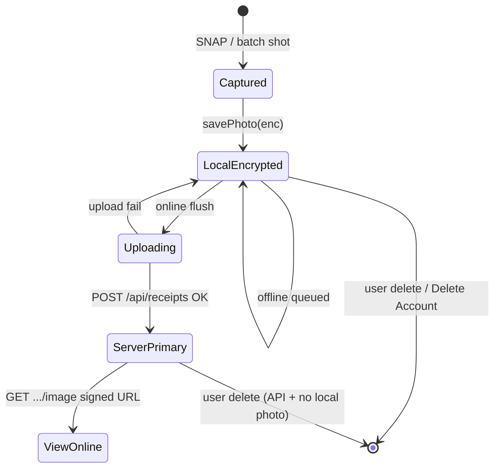

# Local Data Encryption + Server-Primary Image — Design

**Date:** 2026-06-12  
**Status:** Approved (design)  
**Scope:** IndexedDB v3 encrypted local photos; server-primary image after upload; signed URL viewing; metadata shim; local wipe + copy alignment.

**Depends on:** [`2026-06-05-api-security-design.md`](./2026-06-05-api-security-design.md) (Blob private + signed URL) · [`2026-06-10-indexeddb-receipt-query-design.md`](./2026-06-10-indexeddb-receipt-query-design.md) (IDB v2 indexes) · [`2026-06-07-receipt-sync-ghost-reconcile-design.md`](./2026-06-07-receipt-sync-ghost-reconcile-design.md) (safe reconcile)

**Store 命名（Canonical）：** 本文档中的 `photos` / `receipts` / `meta` 为 **legacy v4** 名；规范名见 [`DB-DESIGN-SPEC.md`](../../tech/DB-DESIGN-SPEC.md) §2.2（`snaptax_receipt_photos` · `snaptax_receipts` · `snaptax_crypto_meta`）。

**图片存储（Supersedes §5.3 起 IDB 存密文 Blob）：** IndexedDB **仅元数据**；像素 → **OPFS**；拍照 **1280×960 / JPEG 75% / 200～300KB**；已同步 **≥90 天** 删原图留缩略图 — 见 [`12-local-image-storage-design.md`](../../tech/12-local-image-storage-design.md)。

---

## 1. Problem

1. **本地照片明文** — `photos` store 存原始 JPEG/PNG `Blob`，DevTools / 备份 / 未锁屏可直接读取。
2. **上传后仍长期保留本地副本** — `HomeScreen` 在 `uploadReceipt` 成功后仍 `savePhoto(serverId, file)`，与「云端为主」不一致，扩大攻击面。
3. **无服务端看图路径** — API `serializeReceipt` 不返回 `imageUrl`；`resolveReceiptImage` 几乎总走 `loadPhoto`，客户端无法以 Blob 为准。
4. **文案过度承诺** — `ReceiptDetailSheet` 写 *encrypted and secure*，Privacy 仅披露云端 TLS/AES，未说明本地 at-rest。
5. **Delete Account 擦除不全** — `clearLocalAppData` 未清 onboarding / PWA / auth localStorage。

---

## 2. Goals & non-goals

### Goals

| # | 目标 |
|---|------|
| G1 | **凡落盘本地的照片必须 AES-GCM 加密**（含离线队列、上传前、上传失败重试） |
| G2 | **上传成功后以服务端 Blob 为唯一权威图源**；删除本地密文照片 |
| G3 | **在线查看** 通过 `GET /api/receipts/:id/image` 获取 **≤15min signed URL**（归属校验） |
| G4 | **Ghost 零阻断** — 不设 PIN、不增加首拍 Modal |
| G5 | **保留 IDB v2 索引热路径** — 启动 30 unfiled / top 100 / tax sum 不退化 |
| G6 | **诚实披露** — Privacy / Settings / Detail 文案与实现一致 |

### Non-goals (this epic)

- 用户 PIN / Passkey 解锁（违背傻瓜哲学）
- 防 XSS 下的密钥窃取（靠 CSP + HttpOnly Session，非本方案范围）
- Google 登录后 DEK 云端 wrap / 换机恢复密钥（P2 路线图）
- 本地 receipt 元数据全字段加密（P1 仅加密高敏字段；索引 shim 保持明文）

---

## 3. Locked decisions

| 主题 | 选择 |
|------|------|
| 照片生命周期 | **S1 — Server-primary after upload** |
| 本地照片加密 | **E1 — AES-GCM-256**，每 blob 随机 12-byte IV |
| 密钥 | **K1 — 设备绑定非提取 DEK**（`crypto.subtle.generateKey`, `extractable: false`） |
| DEK 存储 | IndexedDB `meta` store 存 `CryptoKey` handle（Chromium / Safari PWA 已验证可行） |
| 元数据 | **M1 — 混合**：索引 shim 明文；`merchant` 等进 `enc` payload |
| 金额字段 | **M2 — `amount` / `taxAmount` 保留明文 shim**（tax sum 索引性能；财务敏感但非图像级） |
| 上传成功后 | **立即 `deletePhoto(id)`**；receipt 行标记 `hasRemoteImage: true` |
| 离线已同步票看图 | **占位 UI**：「Photo available when online」；不保留长期本地副本 |
| 上传失败 / pending | **保留加密本地照片** 直至上传成功或用户删除 |
| IDB 版本 | **v3**（v2 → v3 在线迁移） |
| 看图 API | **新增** `GET /api/receipts/:id/image` → `{ url, expiresAt }` |

---

## 4. Photo lifecycle (server-primary)



### 4.1 States

| 状态 | 本地 `photos` | `receipts.hasRemoteImage` | 展示 |
|------|---------------|---------------------------|------|
| `pending_upload` | ✅ 加密 blob | `false` | 解密本地 blob → object URL |
| `uploading` | ✅ 加密 blob | `false` | 同上 |
| `server_primary` | ❌ 已删除 | `true` | signed URL（在线）/ 占位（离线） |
| `upload_failed` | ✅ 加密 blob | `false` | 本地解密；列表显示 sync stuck |

### 4.2 Write paths (changes from today)

**Today (remove):**

```typescript
// HomeScreen — after uploadReceipt success
await savePhoto(serverId, file); // DELETE this pattern
```

**Target:**

```typescript
const uploaded = await uploadReceipt(photo, receipt.timestamp);
await deletePhoto(receipt.id); // old id if id changed
await saveReceipt({
  ...apiReceiptToLocal(uploaded),
  hasRemoteImage: true,
  pendingUpload: false,
});
```

**Online immediate capture (`handleCapture`):** 成功上传后 **不** `savePhoto(serverId, file)`；失败则保留加密本地副本 + `pendingUpload: true`。

**Batch (`handleBatchShot`):** 连拍阶段仅加密写 IDB；`handleBatchDone` flush 时按 pending 流程上传，成功后删本地照片。

### 4.3 Read path — `resolveReceiptImage`

```typescript
export async function resolveReceiptImage(receipt: Receipt): Promise<ImageResolve> {
  if (receipt.hasRemoteImage) {
    if (!navigator.onLine) {
      return { kind: "offline-placeholder" };
    }
    const { url, expiresAt } = await fetchReceiptImageUrl(receipt.id);
    return { kind: "remote", src: url, expiresAt };
  }
  const blob = await loadPhoto(receipt.id); // decrypt inside
  if (!blob) return { kind: "missing" };
  const src = URL.createObjectURL(blob);
  return { kind: "local", src, revoke: () => URL.revokeObjectURL(src) };
}
```

**不缓存 signed URL 到 IndexedDB**（短 TTL + 归属校验）；内存级 cache（Map, TTL < 14min）可选。

---

## 5. Local encryption layer (LEL)

### 5.1 Module layout

```
lib/storage/crypto/
├── keyManager.ts      # DEK init / get; meta store
├── aesGcm.ts          # encrypt/decrypt ArrayBuffer
├── photoStore.ts      # savePhoto / loadPhoto / deletePhoto (encrypted)
└── receiptPayload.ts  # enc JSON for merchant, category, subtitle
```

`receiptDb.ts` — IDB v3 schema, migration, delegates photo ops to `photoStore.ts`.

### 5.2 KeyManager (K1)

```
openDb v3:
  if !meta.dek:
    dek = await crypto.subtle.generateKey(
      { name: "AES-GCM", length: 256 },
      false,  // extractable: false
      ["encrypt", "decrypt"],
    )
    store in meta { version: 1, dek, createdAt }
```

- **不**从 `ghost_id` / localStorage 派生（可预测、非密钥）。
- **不**上传 DEK（P2 再议 wrap）。
- App 卸载 / Delete Account → `clearAllLocalData` 销毁 DEK + 全部密文。

### 5.3 Photo store shape (v3)

> **Superseded by** [`12-local-image-storage-design.md`](../../tech/12-local-image-storage-design.md)：IDB 仅存 `ReceiptPhotoMeta`；密文在 OPFS。以下为 **legacy v3** 形状，迁移后废弃。

```typescript
// photos store — keyPath: id
{
  id: string;
  v: 1;
  alg: "AES-GCM";
  iv: ArrayBuffer;      // 12 bytes
  ct: ArrayBuffer;      // ciphertext
  mime: "image/jpeg";   // for decrypt → Blob type
  byteLength: number;   // original size (quota debug)
}
```

**`savePhoto`:** `File` → `arrayBuffer` → `encrypt` → `put`  
**`loadPhoto`:** `get` → `decrypt` → `Blob`  
**禁止**存储明文 `blob` 字段（v3 migration 删除）。

### 5.4 Receipt metadata (M1 + M2)

```typescript
// receipts store row (v3)
{
  id, status, updatedAtMs, createdAtMs, isFiled,  // index shim — plaintext
  amount?, taxAmount?,                              // M2 plaintext shim
  hasRemoteImage: boolean,
  pendingUpload?: boolean,
  enc?: {
    v: 1;
    iv: ArrayBuffer;
    ct: ArrayBuffer;  // JSON: { merchant, category, subtitle, currency?, ... }
  };
}
```

列表展示金额不触发解密；打开详情时解密 `enc` 补全 `merchant` / `category`。

---

## 6. Server — signed image URL

### 6.1 `GET /api/receipts/:id/image`

| 项 | 规则 |
|----|------|
| Auth | Ghost HMAC **或** Session |
| 归属 | 同 [`api-security-design` §6](./2026-06-05-api-security-design.md) |
| Response 200 | `{ "url": "https://...", "expiresAt": "2026-06-12T12:00:00.000Z" }` |
| TTL | **15 minutes**（`BLOB_SIGNED_URL_TTL_SEC=900`） |
| 404 | 非归属或 receipt 不存在 |
| 无图 | receipt 无 `imageUrl` pathname → 404 |

### 6.2 List API

- **不**在 `GET /api/receipts` 列表返回 signed URL（防批量泄露 + 浪费签名）。
- 客户端用 `hasRemoteImage: true`（本地 receipt 行，sync 后由 `pendingUpload: false` + 无本地 photo 推断，或 API 返回 `hasImage: true` 布尔）。

**推荐：** `ApiReceipt` 增加 `hasImage: boolean`（服务端知悉 Blob 是否存在），sync 时写入本地 `hasRemoteImage`。

---

## 7. Sync & reconcile interaction

| 场景 | 行为 |
|------|------|
| `pendingUpload` + 本地加密图 | 不上传覆盖；flush 优先 |
| 上传成功 | 写 `remoteSyncedAtMs`；**保留** OPFS full + thumb（最多 90 天，见 [`12-local-image-storage-design.md`](../../tech/12-local-image-storage-design.md)）；`hasRemoteImage=true` |
| `syncFromServer` 合并远程行 | 远程 `hasImage` → 本地 `hasRemoteImage=true`；若本地仍有 photo 且已 `hasRemoteImage`，**删除冗余本地 photo** |
| 远程有、本地无图 | 正常；看图走 signed URL |
| 本地有图、远程无（pending） | 保留加密图直至上传 |
| Delete receipt | `deletePhoto` + receipt 行 |
| Delete Account | 全量 IDB clear + 全部 `snap1099_*` localStorage |

与 [`receipt-sync-ghost-reconcile-design`](./2026-06-07-receipt-sync-ghost-reconcile-design.md) 一致：**不因 remote 空列表删本地 pending 行**。

---

## 8. IDB migration v2 → v3

```
onupgradeneeded (2 → 3):
  1. createObjectStore("meta") if missing
  2. KeyManager.initDek()
  3. photos: cursor each row
       if row.blob (plaintext):
         enc = encrypt(row.blob)
         cursor.update({ id, v:1, alg, iv, ct, mime, byteLength })
         delete row.blob
  4. receipts: cursor each row
       build enc payload from merchant/category/subtitle
       set hasRemoteImage = !pendingUpload && !has local photo only if imageUrl — 
         **简化：迁移时 hasRemoteImage = false; 下次 sync 从 API hasImage 修正**
       strip plaintext merchant/category/subtitle into enc
  5. add index on hasRemoteImage if needed (optional; low cardinality)
```

- 大库迁移：`requestIdleCallback` 分批 cursor（每批 20 张），UI 显示可选 background 进度（非阻断）。
- 迁移失败：事务 abort，保持 v2（降级路径）。

---

## 9. Copy & compliance

| 位置 | 变更 |
|------|------|
| `docs/legal/privacy.md` §1 | 增加：本地照片加密缓存；上传后以美国云端为准 |
| Settings Data storage | 区分 **On device:** encrypted offline cache until uploaded · **In cloud:** … |
| `ReceiptDetailSheet` 脚注 | `Your receipt is encrypted in transit. After upload, the original is stored securely on our servers.` |
| i18n `privateSecureDesc` | `Encrypted sync when online. Photos encrypted on device until uploaded.` |
| **禁止** | 「Bank-level」本地加密营销 |

---

## 10. Local wipe (Delete Account)

统一 `lib/storage/clearLocalAppData.ts`：

```typescript
const SNAP1099_LS_PREFIX = "snap1099_";

export async function clearLocalAppData(): Promise<void> {
  await clearAllLocalData(); // IDB all stores incl. meta/DEK
  if (typeof localStorage !== "undefined") {
    for (let i = localStorage.length - 1; i >= 0; i--) {
      const key = localStorage.key(i);
      if (key?.startsWith(SNAP1099_LS_PREFIX)) {
        localStorage.removeItem(key);
      }
    }
  }
}
```

---

## 11. Threat model (post-design)

| 威胁 | 缓解 |
|------|------|
| 未锁屏读 IDB | 照片/商户密文；非照片级金额仍明文 shim |
| 设备备份 | 密文进备份；无 DEK 导出 |
| 上传后手机留存原图 | 上传成功删本地密文 |
| XSS | 不承诺；CSP 加固（并行） |
| 离线看图（已上传） | 占位；迫使用户联网 — 符合 server-primary |
| 换机未登录 | 仍不可恢复（产品已知）；加密不恶化 |

---

## 12. Module map

| File | Change |
|------|--------|
| `lib/storage/crypto/keyManager.ts` | **New** |
| `lib/storage/crypto/aesGcm.ts` | **New** |
| `lib/storage/crypto/photoStore.ts` | **New** |
| `lib/storage/receiptDb.ts` | v3, migration, wire encryption |
| `lib/storage/clearLocalData.ts` | Prefix wipe all `snap1099_*` |
| `lib/types.ts` | `hasRemoteImage?: boolean` on `Receipt` |
| `lib/client/receiptApi.ts` | `fetchReceiptImageUrl`, `ApiReceipt.hasImage` |
| `lib/receipts/receiptDetail.ts` | Server-primary resolve + offline placeholder |
| `app/api/receipts/[id]/image/route.ts` | **New** signed URL |
| `lib/receipts/serialize.ts` | `hasImage: Boolean(imageUrl)` |
| `components/home/HomeScreen.tsx` | Remove post-upload `savePhoto`; delete on success |
| `components/home/OfflineHomeShell.tsx` | Encrypted save only |
| `components/receipts/ReceiptDetailSheet.tsx` | Copy + offline placeholder UI |
| `components/receipts/ReceiptCaptureSection.tsx` | Placeholder state |
| `lib/copy/userFacing.ts` / i18n | Privacy-aligned strings |
| `docs/legal/privacy.md` | §1 local encryption sentence |

---

## 13. Phasing

| Phase | 内容 |
|-------|------|
| **P0** | Copy audit; `clearLocalAppData` prefix wipe |
| **P1** | LEL + IDB v3 migration; encrypted `savePhoto`/`loadPhoto` |
| **P1b** | Server-primary: drop post-upload local save; `deletePhoto` on success |
| **P1c** | `GET .../image` + `resolveReceiptImage` + offline placeholder |
| **P2** | Google login DEK wrap; optional encrypted offline thumbnail cache (24h) for last-viewed |

**MVP 发布建议：** P0 + P1 + P1b + P1c 同迭代发布，避免「加密但仍长期双份存图」中间态。

---

## 14. Acceptance

1. DevTools → Application → IDB `photos`：无 `blob` 字段；`ct` 为密文；文件头非 `FF D8 FF`。
2. 在线拍照上传成功 → `photos` store **无**该 `id` 行；`hasRemoteImage=true`。
3. 详情页在线 → Network 出现 `GET /api/receipts/:id/image`；图片可 zoom。
4. 已上传票离线打开详情 → 占位文案，无 crash。
5. 离线拍照 → 加密本地可预览；联网上传后本地删除。
6. `sumUnfiledLocalTaxSaved` / 启动 30 条性能与 v2 同级（±20%）。
7. v2 → v3 迁移：既有小票数量、税额一致；旧明文照片变密文。
8. Delete Account → 无 `snap1099_*` localStorage；IDB 空。
9. Privacy / Detail 文案无「本地 false encrypted」过度承诺。

---

## 15. Related docs

- [`2026-06-05-api-security-design.md`](./2026-06-05-api-security-design.md) — Blob private, signed URL TTL
- [`2026-06-05-compliance-privacy-design.md`](./2026-06-05-compliance-privacy-design.md) — U2 披露
- [`2026-06-10-indexeddb-receipt-query-design.md`](./2026-06-10-indexeddb-receipt-query-design.md) — v2 indexes (preserved)
- Implementation plan: [`../plans/2026-06-12-local-data-encryption.md`](../plans/2026-06-12-local-data-encryption.md)
