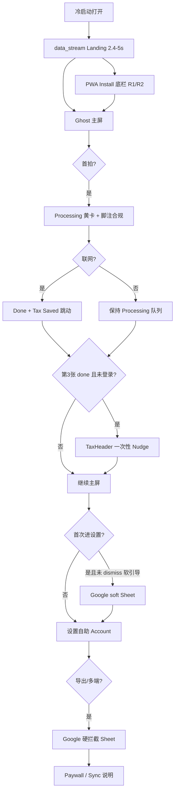

# Snap1099 新人引导设计 — 业务分析与交互规范

**日期：** 2026-06-12  
**状态：** 已实现（2026-06-13 接线完成）  
**读者：** 产品、设计、研发、测试、Cursor Agent  
**Canonical 产品规范：** [`docs/product/PRODUCT-SPEC.md`](../../product/PRODUCT-SPEC.md)  
**前置规格：**

- [`2026-06-10-unified-data-stream-splash-design.md`](./2026-06-10-unified-data-stream-splash-design.md) — 冷启动 Landing
- [`2026-06-05-google-auth-prd-design.md`](./2026-06-05-google-auth-prd-design.md) — Google 软/硬门控
- [`2026-06-07-home-remove-google-banner-design.md`](./2026-06-07-home-remove-google-banner-design.md) — 主屏去横条
- [`2026-06-05-compliance-privacy-design.md`](./2026-06-05-compliance-privacy-design.md) — U2 合规触点
- [`2026-06-10-pwa-install-ui-modes-design.md`](./2026-06-10-pwa-install-ui-modes-design.md) — PWA 安装引导

---

## 1. 业务分析

### 1.1 目标用户与场景

| 维度 | 描述 |
|------|------|
| **人群** | 北美 / 欧盟 **1099 自雇合同工** — 卡车司机、水管工、电工、建筑工、外卖骑手等蓝领 |
| **环境** | 工地、车厢、加油站；强光、满手油污、戴手套、单手操作 |
| **网络** | 弱网 / 断网常见；用户需要「拍完就走」的确定性 |
| **财务认知** | 低 — 不懂 Schedule C、进项 VAT；不愿填表 |
| **核心诉求** | 小票别丢、能抵税、报税季能一键导出 |

**产品哲学（铁律）：** 前台傻瓜、后台聪明 — 引导必须 **教行为，不考知识**。

### 1.2 Jobs-to-be-Done（JTBD）

| 阶段 | 用户想说的话 | 产品必须交付 |
|------|--------------|--------------|
| **发现** | 「这 App 靠谱吗？会不会很复杂？」 | 2.4s 内建立「专业报税工具 + 工地能用」信任 |
| **激活** | 「我拍一张试试」 | 零登录、零表单，一按就开拍 |
| **首价值** | 「它接单了吗？钱算出来了吗？」 | Processing → Done 三态 + 顶栏 Est. Tax Saved 跳动 |
| **习惯** | 「我每天扔小票就行」 | 离线队列、列表安全感、连拍快车道 |
| **沉淀** | 「换手机会不会全没了？」 | Google 备份引导（后置、可跳过一次） |
| **变现** | 「报税季我要 Excel」 | 硬拦截 Google → Paddle $49 → 导出 |

### 1.3 漏斗与 KPI

```
安装/打开 → 冷启动 Landing → 主屏 → 首拍 → 第2/3拍 → Google 绑定 → 报税季导出付费
```

| KPI | 目标 | 引导设计关联 |
|-----|------|--------------|
| 首屏可操作 | ≤ **1.5s** | 静态 Landing Shell + 并行 warm IDB / Home chunk |
| 拍照放弃率 | ≤ **5%** | 主屏 **零 Modal**；首拍无额外面板 |
| Google 绑定转化率 | ≥ **40%** | 软引导（第 3 张票 / 首次设置）+ 硬拦截（导出/多端） |
| Paddle 转化 | 监控 | Paywall 换机警告；不在新人期谈钱 |

### 1.4 竞品与差异化（引导视角）

| 常见记账 App | Snap1099 引导策略 |
|--------------|-------------------|
| 首屏注册/问卷 | **Ghost 零阻断** — 先拍后绑 |
| 教程轮播 4–5 页 | **单次冷启动 Landing ≤5s**，无多页 Coach |
| 模糊确认弹窗 | **拍完即走** — 错误用列表红字 Resnap |
| 云端同步首屏承诺 | **换机警告后置** — 设置 Account + 软/硬门控 |

### 1.5 业务风险与引导对策

| 风险 | 业务后果 | 引导对策 |
|------|----------|----------|
| 换机数据丢失 | 差评、退款 | 设置 Account 常驻警告；软引导强调 Google；Paywall 再警告 |
| 弱网以为没保存 | 弃用 | Processing + Uploading 黄卡心理学 |
| 合规投诉 | 法律风险 | Snap 脚注隐式同意；**不做**首张票安全卡片（U2） |
| 首屏过重 | 流失 | 2026-06-07 移除主屏 Google 横条；拍照区无遮挡 |
| 安装率低 | 留存差 | Landing 后 PWA 底栏 / 顶栏 Install（Android） |

### 1.6 与现有 PRD 的差异 reconciling

| 文档 | 说法 | **本规范裁定（2026-06-12）** |
|------|------|------------------------------|
| PRD §2.3 | 主屏列表上方 Google **横条** | **不恢复横条**（见 [`home-remove-google-banner`](./2026-06-07-home-remove-google-banner-design.md)）；软引导改为 **设置页 Sheet + 顶栏一次性 Nudge** |
| `0.0.1.update.md` §2.2 | 首张票 **安全卡片** | **不做**（PRODUCT-SPEC §2.3.2 U2 已锁定） |
| PRD §2.3 | 第 3 张票 **或** 首次进设置 | **保留双触发**；实现位置见 §4.3 |
| Skill 决策树 | 主屏 soft banner | **更新为** 设置 Sheet + TaxHeader nudge |

---

## 2. 引导设计原则

### 2.1 不可违反

1. **核心拍照零 Modal** — 引导不得遮挡 SNAP RECEIPT 或打断相机流
2. **仅 Bottom Sheet** — Google / Paywall / Terms / Delete；禁止居中 Dialog
3. **渐进披露** — 信任 → 行为 → 账户 → 付费，顺序不可逆
4. **一次.dismiss 永久** — 软引导「稍后再说」仅一次；硬拦截无跳过
5. **英文 UI 字符串** — 用户可见文案走 i18n `messages/*.json`（税务/IRS 术语保持英文）

### 2.2 引导 ≠ 教程

| 要做 | 不做 |
|------|------|
| 用 **状态机 UI**（Processing/Done/Blurry）教系统行为 | 多页「如何使用」轮播 |
| 用 **Landing 动画** 建立专业感 | 首次打开隐私阻挡全屏 |
| 用 **一次性 Nudge** 指向设置/备份 | 主屏常驻横幅挡列表 |
| 用 **脚注** 完成隐式合规同意 | Cookie 追踪横幅 |

---

## 3. 新人旅程总览



### 3.1 阶段定义

| 阶段 | 时间窗口 | 目标 | 主要触点 |
|------|----------|------|----------|
| **P0 冷启动** | 0–5s | 信任 + 预加载 | `LandingStaticShell` → `DataStreamLanding` |
| **P1 幽灵激活** | 首次进主屏 | 零摩擦开拍 | Ghost 注册、合规脚注 |
| **P2 首拍教育** | 第 1 张票 | 「系统接单了」 | Processing 列表 + Uploading 标签 |
| **P3 价值确认** | 第 1 张 done | 「能省钱」 | Est. Tax Saved 绿动效 |
| **P4 习惯巩固** | 第 2–3 张 | 离线/连拍心智 | 队列、Flash Done、PWA 安装 |
| **P5 账户沉淀** | 第 3 张 done 或首次设置 | Google 备份 ≥40% | Nudge + soft Sheet |
| **P6 深度设置** | 任意 | 行业/语言/隐私 | Settings 六行业、Privacy |
| **P7 变现门控** | 报税季 | 付费导出 | hard-export → Paywall |

---

## 4. 分阶段交互规范

### 4.1 P0 — 冷启动 Landing（已实现）

**规格：** [`unified-data-stream-splash-design`](./2026-06-10-unified-data-stream-splash-design.md)

| 项 | 规范 |
|----|------|
| 变体 | 仅 `data_stream`；无 A/B / Flags |
| 最短停留 | **2400ms**（动画完成） |
| 软上限 | **5000ms** → `OfflineHomeShell` 降级 |
| 业务意图 | 五段式「报税工具加载中」— 建立 **IRS / 离线 / 蓝领** 心智，非功能教程 |
| 退出后 | 派发 `snap1099:landing-done` → 允许 PWA Install 条 |

**文案（i18n `Landing` 命名空间）：** Checklist 5 项 + Log 7 行 + Footer 3 列 — 见 `dataStreamCopy.ts` / `messages/*.json`。

**验收：** 每次冷启动均显示；弱网 5s 无黑屏；`html.landing-done` 后 Install 可出。

---

### 4.2 P1 — Ghost 主屏（已实现）

| 触点 | 行为 | 业务意图 |
|------|------|----------|
| Ghost 注册 | `ensureGhostSession()` 静默 | 设备级 ID，用户无感 |
| TaxHeader | `Est. Tax Saved` 无小票时 `$—` | 预留财富反馈锚点 |
| SNAP RECEIPT | 热区 >96px，`active:scale-95` | 唯一核心 CTA |
| 合规脚注 | `By snapping, you agree... United States.` | U2 隐式同意；Terms/Privacy → Sheet |
| 列表空态 | 无阻塞占位 | 不逼首拍 |

**禁止：** 首屏登录横条、工种问卷、隐私全屏、Cookie 横幅。

---

### 4.3 P2/P3 — 首拍与价值确认（部分实现）

#### 列表三态（产品教育核心）

| 状态 | UI | 用户学到 |
|------|-----|----------|
| A Processing | 黄字 + `Uploading` 黄标 | 「已接单，可扔纸质票」 |
| B Done | 金额 + 商户 + 白底标签 | 「AI 分好类了」 |
| C Blurry | 红字 `Tap to resnap` | 「糊了要重拍，不弹窗」 |

#### 顶栏财富反馈

- 首张 **done** 且 `tax_amount` 汇总变化 → **绿色数字跳动**（`taxAnimating`）
- 副标题：`{n} receipt(s) · ${total} tracked`

#### 明确不做

- ~~首张票 Bank-Level Security 卡片~~（`0.0.1.update.md` 已废弃，U2 锁定）

---

### 4.4 P4 — 习惯巩固（已实现 / 并行）

| 能力 | 引导方式 |
|------|----------|
| 离线拍照 | 状态 A 持续；顶栏 `Offline · Queued` |
| 连拍 | Live Footer：`FLASH DONE` / `DONE & REVIEW` |
| PWA 安装 | Landing 完成后底栏 Install（R1/R2）；Not now → 顶栏按钮（R3） |
| 行业 | AI 猜默认；用户可在设置改 — **不阻断首拍** |

---

### 4.5 P5 — Google 软引导（已实现）

> **2026-06-13：** T1 Nudge + T2 首次 Settings Sheet 已接线 — 见 [`2026-06-13-product-code-alignment-design.md`](./2026-06-13-product-code-alignment-design.md)

#### 锁定决策

| 决策点 | 选择 | 理由 |
|--------|------|------|
| 主屏横条 | **不恢复** | 保护首拍转化率；列表区不被挡 |
| 软引导载体 | **TaxHeader Nudge + Settings soft Sheet** | 符合 Bottom Sheet 铁律；可达 KPI |
| 跳过规则 | **全局一次**「Not now」后两种触发均不再自动弹出 | 与 PRD §2.3 一致 |
| 已登录 | 所有软引导静默 | — |

#### 触发器 T1 — 第 3 张 `done` 小票（主屏）

**条件（全部满足）：**

- `done` 状态小票计数 **≥ 3**
- 未 Google 登录
- `localStorage.snap1099_soft_guide_dismissed !== '1'`
- 本次会话未展示过 T1（内存 flag，防刷新重复）

**UI — TaxHeader 一次性 Nudge：**

```
位置：Est. Tax Saved 副标题行下方（或替换副标题一行）
样式：text-yellow-400 text-[11px] font-bold
文案：Afraid of losing data? Back up with Google →
热区：整行可点，≥64px 高
动作：setView('settings') + 打开 googleSheet mode=soft
自动消失：点击后 / 进设置后 / 10s 无操作 fade-out（当次会话）
```

**约束：** 不遮挡 SNAP 按钮；非 Modal；不自动弹 Sheet（须用户点击 Nudge 或进设置）。

#### 触发器 T2 — 首次进入设置页

**条件：**

- 用户第一次打开 `SettingsScreen`（`localStorage.snap1099_settings_visited !== '1'`）
- 未 Google 登录
- 未 `soft_guide_dismissed`

**UI：** 进入设置后 **延迟 300ms** 自动 `setGoogleSheet('soft')` — 现有 `GoogleSignInSheet` soft 模式。

**首次标记：** 进入设置即写 `snap1099_settings_visited = '1'`（与是否登录无关）。

#### Soft Sheet 文案（i18n `auth.google.soft`）

| 字段 | 英文（canonical） |
|------|-------------------|
| title | Save your receipts |
| body | Sign in with Google to back up your receipts and tax data. **Required before switching phones.** |
| CTA | Continue with Google |
| dismiss | Not now |

**Dismiss 行为：** `snap1099_soft_guide_dismissed = '1'`；关闭 Sheet；T1 Nudge 永不再自动出现。

**登录成功：** 静默绑定 Ghost；Sheet 关闭；**无庆祝 Modal**；Account 区变绿。

#### 与设置 Account 区的关系

| 场景 | Account 区 | 自动 Sheet |
|------|------------|------------|
| 用户主动点 Continue with Google | 常显警告 + 按钮 | 手动打开 soft |
| T2 首次进设置 | 同左 | 自动 soft |
| 已 dismiss | 仅 Account 区 | 不再自动 |

---

### 4.6 P6 — 设置页深度引导（已实现）

| 区块 | 引导作用 |
|------|----------|
| Account | 未登录黄字 + backupHint + Google CTA |
| Language | 自动检测 + 手动切换 |
| Industry | 六选一；改善 AI 分类 |
| Privacy & Data | US storage 告知；Delete Account |
| View on All Devices | → 硬拦截 sync |
| Export | → 硬拦截 export → Paywall |

---

### 4.7 P7 — 硬拦截与付费（已实现）

| 入口 | Sheet mode | 可跳过 |
|------|------------|--------|
| Export IRS Tax Pack | `hard-export` | 否（仅 BACK） |
| View on All Devices | `hard-sync` | 否 |
| Paywall | 换机警告文案 | 否（付款或关闭） |

登录成功 → 继续原动作（Paywall / SyncInstructionsSheet）。

---

## 5. 状态与存储

| Key | 类型 | 用途 |
|-----|------|------|
| `snap1099_soft_guide_dismissed` | `'1'` | 软引导全局 dismiss |
| `snap1099_settings_visited` | `'1'` | 首次进设置（T2） |
| `snap1099_pwa_has_visited` | `'1'` | PWA 安装逻辑 |
| `snap1099_pwa_install_dismissed_at` | ISO | PWA Not now |
| Ghost HMAC Cookie | httpOnly | 服务端 Ghost 会话 |
| `NEXT_LOCALE` | cookie | UI 语言 |

**删除账户：** 清除本地 keys + IDB；服务端 `DELETE /api/users/me`。

---

## 6. 视觉与无障碍

| 规则 | 应用 |
|------|------|
| 配色 | 黑 `#000000` / 白 `#FFFFFF` / 黄 `#EAB308` |
| 热区 | 引导可点区域 ≥ **64px**；SNAP > **96px** |
| 反馈 | `active:scale-95` |
| Nudge | 黄字高对比；WCAG AAA |
| Sheet | 底滑、`border-t-4 border-yellow-500` |
| a11y | Nudge `role="status"`；Sheet 焦点陷阱 |

---

## 7. 埋点与观测（建议）

| 事件 | 属性 | 用途 |
|------|------|------|
| `onboard.landing.exit` | `mode: full-home \| offline-pack`, `elapsed_ms` | 冷启动性能 |
| `onboard.first_snap` | `online: boolean` | 激活率 |
| `onboard.first_done` | `tax_amount` | 首价值 |
| `onboard.soft.nudge_shown` | `trigger: third_receipt` | T1 曝光 |
| `onboard.soft.nudge_tap` | — | T1 转化 |
| `onboard.soft.sheet_auto` | `trigger: first_settings` | T2 曝光 |
| `onboard.soft.dismiss` | — | 跳过率 |
| `onboard.google.bind` | `source: soft \| hard-export \| hard-sync \| account` | KPI ≥40% |
| `onboard.pwa.install_prompt` | `mode: bar \| header-button` | 安装漏斗 |

日志格式遵循 [`snap1099-logging.mdc`](../../../.cursor/rules/snap1099-logging.mdc) 单行 key=value。

---

## 8. 实现状态对照

| 引导能力 | 设计阶段 | 代码状态 | 备注 |
|----------|----------|----------|------|
| data_stream Landing | P0 | ✅ | `LandingGate` + `DataStreamLanding` |
| Ghost 零阻断 | P1 | ✅ | `ensureGhostSession` |
| 合规脚注 | P1 | ✅ | Snap 区脚注 |
| 列表三态 | P2/P3 | ✅ | `ReceiptList` |
| Tax Saved 动效 | P3 | ✅ | `TaxHeader` |
| PWA Install | P4 | ✅ | `InstallPrompt` + `TaxHeader` |
| 连拍 / 离线 | P4 | ✅ | 相机 + `useIsOnline` |
| **T1 第三张 Nudge** | P5 | ❌ | 本规范新增 |
| **T2 首次设置 Sheet** | P5 | ❌ | 本规范新增 |
| **soft_guide_dismissed 存储** | P5 | ❌ | 移除 banner 时一并删掉，需恢复 |
| Settings Account | P5/P6 | ✅ | `AccountStatusBlock` |
| Google 硬拦截 | P7 | ✅ | `GoogleSignInSheet` |
| Paywall | P7 | ✅ | mock Paddle |

---

## 9. 实现清单（研发）

### 9.1 文件触点

| 文件 | 变更 |
|------|------|
| `lib/client/authStorage.ts` | 恢复 `isSoftGuideDismissed` / `dismissSoftGuideForever` |
| `components/home/TaxHeader.tsx` | 可选 `nudge` prop + 一次性展示 |
| `components/home/HomeScreen.tsx` | 第 3 张 done 计数 → 展示 Nudge → 导航设置 |
| `components/settings/SettingsScreen.tsx` | `useEffect` 首次访问 → soft Sheet |
| `lib/i18n/*.json` | `home.taxHeader.backupNudge`、复用 `auth.google.soft` |
| `.cursor/skills/snap1099-product/SKILL.md` | 更新决策树（无主页横条） |

### 9.2 测试用例

1. 新 Ghost：Landing → 主屏无 Google UI
2. 拍 3 张至 done：出现 Nudge；点进设置弹出 soft Sheet
3. soft Sheet「Not now」：Nudge 不再出现；再进设置不自动 Sheet
4. 首次进设置（未拍满 3 张）：自动 soft Sheet
5. 已登录：无 T1/T2
6. Export / 多端：硬拦截仍正常
7. `npm run test:unit` — authStorage dismiss 单测

---

## 10. 验收标准

| # | 场景 | 预期 |
|---|------|------|
| 1 | 冷启动 4G | ≤1s 见静态 Hero；2.4s 动画；无白屏 |
| 2 | 新用户首拍 | 无 Modal；列表 Processing |
| 3 | 首张 done | Tax Saved 跳动 |
| 4 | 第 3 张 done 未登录 | TaxHeader Nudge 出现一次 |
| 5 | 首次设置未登录 | soft Sheet 自动；可 Not now |
| 6 | Not now 后 | 无自动软引导；Account 区仍可手动登录 |
| 7 | 导出未登录 | hard-export；无 Not now |
| 8 | 核心拍照 | 全程无居中 Modal |

---

## 11. 范围外（YAGNI）

- 多页新手 Coach Mark / 手指动画
- 首张票安全卡片
- 主屏 Google 横条（已永久移除）
- Apple Sign-In 引导
- 报税季付费相关的新手教程
- Landing `simple_using` 变体复活

---

## 12. 文档索引

| 文档 | 关系 |
|------|------|
| [PRODUCT-SPEC.md](../../product/PRODUCT-SPEC.md) | Canonical 铁律 |
| [0.0.1.md](../../prd/0.0.1.md) | PRD §2.1–§2.4 交互原文 |
| [mvp-master-implementation.md](../plans/2026-06-07-mvp-master-implementation.md) | 落地顺序 |
| [i18n-internationalization-design.md](./2026-06-11-i18n-internationalization-design.md) | 文案命名空间 |

**变更流程：** 产品决策 → **本文件** → PRODUCT-SPEC §4 → PRD → `messages/*.json` → 代码
