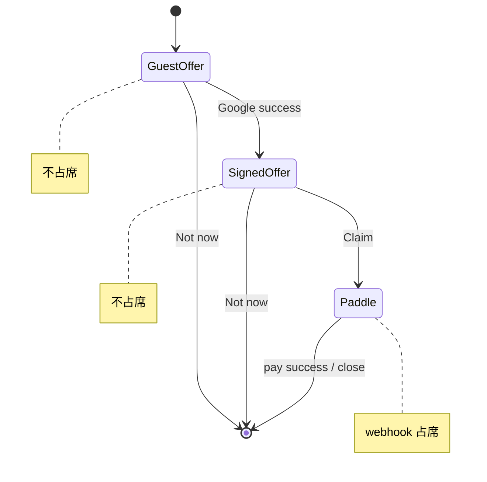

# Founder Google / Pay Decouple — Design

**Date:** 2026-07-03  
**Status:** Approved (brainstorming + grill-me 7 题)  
**Scope:** Google 登录不占席；付款才占席；Sheet 可选付/不付；Widget 可见性；Settings Export 与 Founder SKU 统一。

**References:** `docs/superpowers/specs/2026-07-03-founder-widget-marking-v1-design.md` · `docs/superpowers/specs/2026-06-30-founder-program-widget-design.md`

---

## Problem

1. Sheet 文案「Sign in with Google to **become a Founder**」暗示登录 = 占席（后端并非如此）。
2. Google 登录后缺少明确的 **不付款 / 关闭** 路径。
3. GIS 标准按钮显示系统语言（如中文），与英文 Deal 混排。
4. 已购当季 Export 的用户仍看到营销 Widget。
5. Settings Paywall 与 Founder Sheet 的 SKU / 占席规则需在 spec 层写死为 **同一套 Founder 定价 + 前 50 席**。

## Locked decisions (grill-me)

| # | 决策 |
|---|------|
| 1 | 关 Sheet 未付款 → **Widget 继续显示**（可再开 Sheet） |
| 2 | **是** — 文案禁令：Google = 登录以便付款；Founder/占席 **仅** 付款成功后 |
| 3 | **方案 3** — Sheet 并列：优惠 + 主 CTA + **Not now** 文字链 |
| 4 | **已购买当季 Export** → **不显示** 营销 Widget |
| 5 | **B** — Sheet 内 **英文自定义** Google 按钮（`ContinueWithGoogleButton`），不用 GIS 标准外露文案 |
| 6 | **B** — 不写「登录锁席」；保留 `Offer ends when {total} spots are gone` |
| 7 | **Settings Export 走 Founder SKU 路径**；**席位只给前 50 位成功付款**（`assignFounderSeat`） |

---

## Product rules

### 占席（不变，写清）

- `founder_number` / `claimedCount` **仅在 Paddle webhook 成功且 skuTier ∈ {SUPER, EARLY, FOUNDER}** 时分配。
- Google 登录、checkout intent 创建、关 Sheet **均不占席**。
- 第 51+ 笔 Export 使用 **DEFAULT** SKU，**不分配** founder 席。

### 文案禁令

- ❌ become a Founder / join founders / login locks your spot / reserve  
- ✅ Sign in with Google to **claim your spot** / **pay** / **export this season**  
- ✅ Founder / seat # / Badge **仅** 付款成功后的 Settings 与 post-purchase 态

### Widget 可见性（扩展）

```ts
isFounderWidgetVisible({
  enabled,
  claimedCount,
  founderStatus,
  currentSeasonEntitled, // NEW
})
```

| 条件 | Widget |
|------|--------|
| flag off | 隐藏 |
| claimedCount ≥ 50 | 隐藏 |
| founderStatus === active | 隐藏 |
| **currentSeasonEntitled === true** | **隐藏** |
| 其余 | 显示 |

`WidgetStack` 从 `/api/founder/program` 传入 `user.currentSeasonEntitled`。

---

## FounderProgramSheet UX（方案 3）

### 布局（所有未 entitled 态）

```
┌ First 50 Deal ───────────────── ✕ ┐
│ {remaining} of {total} seats left │
│ $X.XX for this tax season         │
│ Offer ends when {total} spots...  │
│                                   │
│ [ Guest: CONTINUE WITH GOOGLE ]   │  ← 英文自定义按钮 (5B)
│   或 [ Signed in: CLAIM — $X ]    │
│                                   │
│ Not now                           │  ← 文字链，关 Sheet，不占席
└───────────────────────────────────┘
```

### 状态机



- **Guest：** 优惠块 + `ContinueWithGoogleButton` + Not now  
- **Signed in，未 entitled：** 优惠块 + `Claim my spot — {price}` + Not now  
- **alreadyEntitled：** 仅说明文案，无 CTA（与 Widget 隐藏一致）  
- **program full：** 红色 `programFull`，无 Claim  

### Google 按钮 (5B)

- 使用 `ContinueWithGoogleButton`（`settings.account.googleCta` = **CONTINUE WITH GOOGLE**）。
- GIS **credential** 通过 **Sheet 内 invisible overlay** 挂载（`mountGoogleSignInButton` 于透明 host，与自定义按钮同热区），**禁止** `requestGoogleCredential()` body 固定层。
- 登录成功 → `applyGoogleSignIn` + refresh program → 切 **SignedOffer**（隐藏 Google 行，显示 Claim）。

### Not now

- 等同 Sheet `onClose`；**不** dismiss Widget；**不** 写 localStorage 永久隐藏。
- i18n：`founderSheet.notNow`（如 `Not now`）。

### i18n 变更

| Key | 旧 | 新 |
|-----|----|----|
| `signInFirst` | …become a Founder | Sign in with Google to **claim your spot** |
| `notNow` | — | Not now |

---

## Settings Export / Paywall (7)

### 目标

Settings **Export Paywall** 与 Founder Sheet 使用 **同一套** `resolveFounderCheckoutSkuTier` / `resolveSeasonOfferFromState` 定价；前 50 席付款者获得 founder 席 + 当季 Export。

### 现状 vs 改动

| 项 | 现状 | 本 spec |
|----|------|---------|
| Paywall 价格 | `useSeasonOffer()` ✓ | 保持 |
| checkout-intent | `{ taxSeason }` → server 解析 tier ✓ | 保持；文档化 |
| webhook 占席 | skuTier 非 DEFAULT 时 `assignFounderSeat` ✓ | 保持 |
| Paywall 满员错误 | 通用 paymentUnavailable | 对齐 Founder Sheet `programFull` |
| founderPurchase flag | 仅 Founder Sheet 传 `true` | **可选统一**：Export 也传 `founderPurchase: true` 或依赖 server 已统一的 tier 解析（实现选最小 diff） |

### 满员后 Settings

- `checkout-intent` → `FOUNDER_PROGRAM_FULL` → 专用文案；价格回落 DEFAULT（已有 server 逻辑）。
- 不占席；用户仍可得 Export @ DEFAULT。

---

## 不变

- marking v1：禁 forever、禁假倒计时、Sheet 非 Accordion、满员全员隐藏 Widget（含 entitled 检查后的并集）。
- 付款成功 active founder → Widget 隐藏；Settings Badge。
- Google **硬门控** 仍在 **Paddle 前**（Export / Founder 均需 Google session）。

---

## Implementation checklist

- [ ] 扩展 `isFounderWidgetVisible` + tests（`currentSeasonEntitled`）
- [ ] `WidgetStack` 传入 entitled；entitled 时 `showFounder=false`
- [ ] `FounderProgramSheet` 方案 3 布局 + `notNow` + 文案更新
- [ ] 替换 `GoogleSignInButtonHost` 为 overlay GIS + `ContinueWithGoogleButton`
- [ ] PaywallSheet：`FOUNDER_PROGRAM_FULL` 文案（与 Sheet 一致）
- [ ] 确认 Paywall checkout 路径 webhook 占席与 Founder Sheet 一致（集成测试或文档注释）

---

## Out of scope

- Widget dismiss 本季（grill 题 1 未选 B）
- GIS 多语言标准按钮（grill 题 5 选 B）
- Tier ladder UI（Phase 2）
- 「登录锁价 forever」类文案
