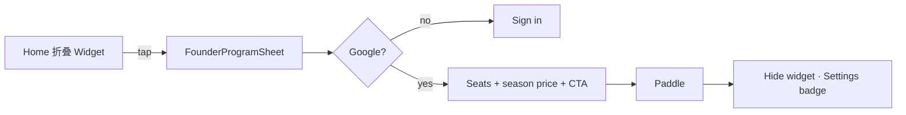

# Founder Widget — marking-0.1.v1 收敛设计

**Date:** 2026-07-03  
**Status:** Approved (grill-me + product decisions)  
**Mock:** `docs/ui/marking-0.1.v1.png`  
**Scope:** 从六态 mock 中采纳可落地部分；拒绝与产品铁律冲突的交互。

**References:** `docs/superpowers/specs/2026-07-02-founder-widget-copy-design.md` · `docs/superpowers/specs/2026-06-30-founder-program-widget-design.md`

---

## Grill 冲突决议

| # | Mock 冲突 | 决议 |
|---|-----------|------|
| **1** | 「forever / lock forever」 | **仅当前报税季。** Widget/Sheet 只说 `{price} export this season` / `{price} for this tax season`。禁止 forever、lifetime、lowest price forever。档位列 `founderTier` 续费规则见 2026-06-30 spec，不在 Widget 展开。 |
| **2** | 假倒计时 `23:59:47` | **去掉。** 仅用 `{remaining} spots left`；`remaining ≤ 10` 时 scarcity 行变红（urgency），无时间字段、无客户端计时器。 |
| **3** | 「Max tax refund priority support」等 | **去掉。** Sheet 不列未履约卖点；Home 折叠态也不承诺 support / exclusive 权益文案。 |
| **4** | 内联 Accordion 展开 | **选 C：** Home 仅**折叠单态**卡片；点击 → **FounderProgramSheet** → Google → Paddle。不实现 mock 展开态、^ 收起、内联 CLAIM 按钮。 |
| **5** | 售罄 + Waitlist | **选 A：** `claimedCount ≥ 50` → Widget **全员隐藏**（现状 `isFounderWidgetVisible`）。不做 Sold Out 卡、Waitlist、Join 200+ users。 |

---

## 题 6 / 7（Locked）

| # | 问题 | 决议 | 理由 |
|---|------|------|------|
| **6** | 阶梯价 UI 放哪？ | **Locked A — 仅 Sheet / Paywall（二期可选）** | Home 保持单态 + 104px 级卡片；四档 ladder 不进 Widget pager。MVP Sheet：席位 + 当季价 + CTA。 |
| **7** | 付款成功后 Widget？ | **Locked A — 立刻隐藏** | Webhook 后 `founderStatus === active` → 不展示 Widget；Settings Founder Badge 承担「已加入」。 |

---

## 从 mock 采纳（视觉 / 文案）

| 采纳 | 实现位置 |
|------|----------|
| 金边 + 👑 + 稀缺主句 | Home `FounderProgramWidget`（已有） |
| `LIMITED` 小 badge | 可选二期；MVP 用 `FIRST 50 ONLY` + NEW 即可 |
| `{remaining} spots left` 低库存变红 | Home Widget，`remaining ≤ 10` |
| 全宽金按钮文案风格 | **Sheet** `becomeFounder` / Paywall CTA（非 Home 内联） |
| `Offer ends when 50 spots are gone` | Sheet 副文案 `founderSheet.offerEnds` |

## 明确不做（mock 六态）

- 内联 Expanded / Tier ladder / Countdown / Success / Sold Out 态  
- Waitlist、假社交证明数字  
- Forever / priority support / founding exclusive 三卖点块  

---

## 交互（锁定）

- Pager：Founder 仍 Page 1 全宽（2026-07-02 pager spec）  
- 满员 / active founder：不渲染卡片  

---

## 文案禁令（marketing）

- ❌ forever · lifetime · lock forever · lowest price forever  
- ❌ priority support · max tax refund · exclusive benefits（无履约则禁）  
- ❌ 倒计时 · waitlist · join N+ users  
- ✅ this season · tax season · spots left · export  

---

## Implementation checklist

- [x] Home copy：`export this season`（2026-07-02）  
- [x] Sheet：`{price} for this tax season`  
- [x] Scarcity urgent red：`remaining ≤ 10` on Widget  
- [x] Sheet line：`Offer ends when {total} spots are gone`  
- [ ] Sheet tier ladder（Phase 2，非 MVP）
