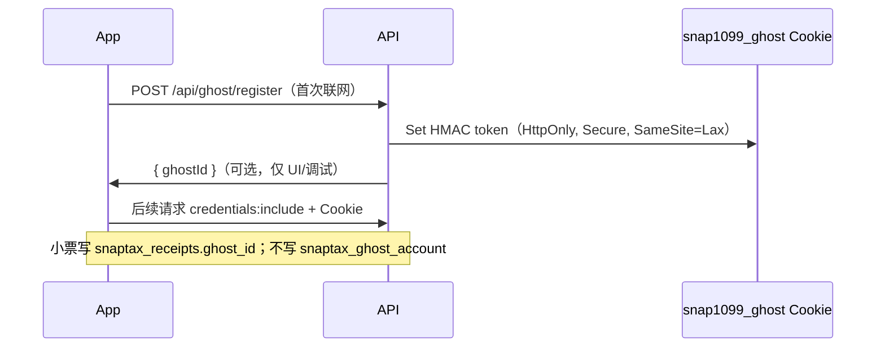
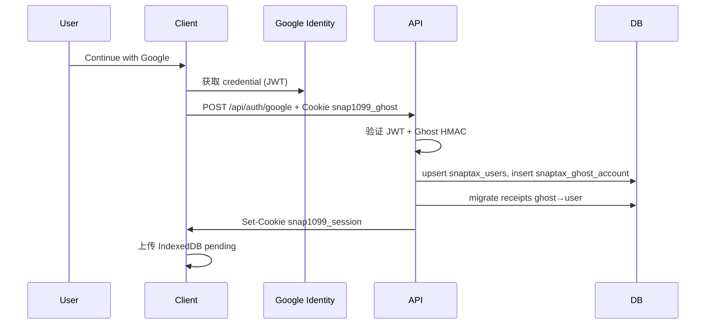

# 05 — Ghost + Google 身份

## 5.1 目标（PRD）

- 首次打开 **零阻断** Ghost
- Google 为 **唯一** 正式凭证
- 登录后 **静默绑定**，UI 数据无感
- 换机未登录 → 数据不可恢复（客户端 + 三处提醒）

## 5.2 Ghost 登记与 HMAC（MVP）

> 详见 [API 安全设计](../superpowers/specs/2026-06-05-api-security-design.md)



**规则：**

1. **服务端** `POST /api/ghost/register` 签发 token；载荷 `{ ghostId, exp }` + HMAC（`GHOST_HMAC_SECRET`）。
2. 客户端 **不可** 仅发送 localStorage 裸 UUID 作为信任依据。
3. `localStorage.snap1099_ghost_id` 可选，**仅** UI 调试；权威身份在 Cookie。
4. **`snaptax_ghost_account` 仅 Google 绑定后 INSERT**（一对一 Ghost ↔ User）。

## 5.3 Google 登录流程



**Request：** `credential`（Google ID Token）；Cookie **`snap1099_ghost` 必填**。Header `X-Ghost-Id` **可选**，若存在须与 token 内 `ghostId` 一致。

## 5.4 Session

**MVP 推荐：** Auth.js v5（NextAuth）Google Provider + custom callback 写 `snaptax_ghost_account`

或自研：

- Cookie：`snap1099_session`（HTTP-only, Secure, SameSite=Lax）
- 值：signed JWT `{ userId, exp }`

## 5.5 门控实现

| 场景 | 检查 |
|------|------|
| 软引导横条 | `!session && !softBannerDismissed && (receipts>=3 \|\| firstSettings)` |
| Export / Multi-device | `session` required |
| API 写操作（未绑定） | 有效 **Ghost HMAC Cookie** |
| API 写操作（已绑定 Google） | **Session** required（Ghost token 只读或拒绝写） |

## 5.6 环境变量

```
GOOGLE_CLIENT_ID=
GOOGLE_CLIENT_SECRET=
AUTH_SECRET=          # Session JWT
GHOST_HMAC_SECRET=    # Ghost token
NEXT_PUBLIC_GOOGLE_CLIENT_ID=
```

Google Console 回调：`https://{domain}/api/auth/callback/google`

## 5.7 安全

- 验证 ID Token：`aud`, `iss`, `exp`
- Ghost 绑定仅允许一次；已绑定 ghost 拒绝绑到其他 user
- Rate limit 登录端点（Vercel KV 或 middleware）
- Google 绑定后：小票写/删须 Session（见 api-security ADR）
