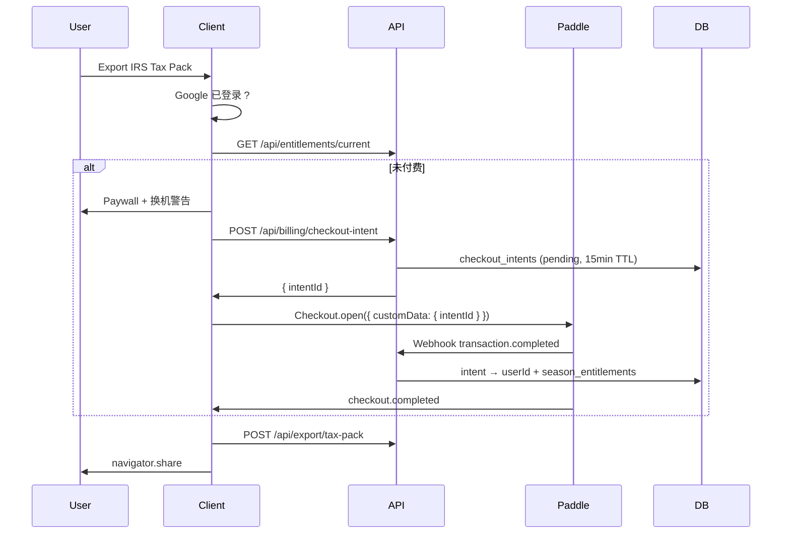

# 07 — Paddle 计费

## 7.1 产品规则（PRD）

- **$49 / 报税季** 一次性（非订阅）
- **Paddle Overlay**（App 内，不跳转）
- 本季 **Export Again** 无限次
- 跨季需重新购买
- Paywall 含换机警告文案

## 7.2 集成组件

| 组件 | 说明 |
|------|------|
| `@paddle/paddle-js` | 客户端 Overlay |
| Paddle Dashboard | Product/Price 配置 |
| `POST /api/webhooks/paddle` | 服务端验签 + 写权益 |

## 7.3 客户端流程



## 7.4 Paddle 配置

- **Product:** Snap1099 Tax Season Export
- **Price:** $49 USD one-time
- **Custom data:** `{ intentId }` — 由 `POST /api/billing/checkout-intent` 签发；**不再**传客户端 `userId`
- **Webhook events:** `transaction.completed`
- **Legacy（30 天兼容）：** `{ userId, taxSeason }` 仍接受但记 warn 日志

## 7.5 Webhook 处理

```typescript
// 伪代码
verifyPaddleSignature(req)
validate amount/status/currency
grant = resolve intentId → checkout_intents.userId (or legacy userId warn)
upsert season_entitlements
mark intent consumed
return 200
```

## 7.6 权益检查

```typescript
const entitlement = await prisma.snaptaxSeasonEntitlement.findUnique({
  where: {
    userId_taxSeason: { userId, taxSeason: "2026" },
  },
});
const paid = !!entitlement;
```

当前 tax_season：服务器按 UTC 日期计算（1–4 月 → 当年，否则前一年报税季逻辑可配置）。

## 7.7 环境变量

```
NEXT_PUBLIC_PADDLE_CLIENT_TOKEN=   # 客户端
PADDLE_API_KEY=                    # 服务端
PADDLE_WEBHOOK_SECRET=
PADDLE_PRICE_ID=                   # pri_...
```

## 7.8 测试

- Paddle Sandbox 环境 + Preview deployment webhook URL
- 测试卡：https://developer.paddle.com/...

## 7.9 UI 状态

| 状态 | 导出按钮 |
|------|----------|
| 未登录 | 硬拦截 Google |
| 已登录未付 | Paywall |
| 已付本季 | `Export Again` |
| 已过季未付 | Paywall（新季价格） |
