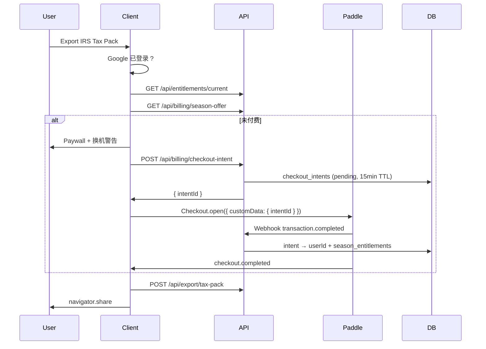

# 07 — Paddle 计费

## 7.1 产品规则（PRD）

- **$49 / 报税季** 一次性（非订阅）
- **Paddle Overlay**（App 内，不跳转）
- 本季 **Export Again** 无限次
- 跨季需重新购买
- Paywall 含换机警告文案

## 7.2 集成组件

| 组件 | 说明 |
|------|------|
| `@paddle/paddle-js` | 客户端 Overlay |
| Paddle Dashboard | Product/Price 配置 |
| `GET /api/billing/season-offer` | 服务端解析本季展示价格（Founder / DEFAULT / 内测 SPECIAL） |
| `POST /api/billing/checkout-intent` | Google session 下签发 checkout intent；写入 userId / taxSeason / skuTier |
| `POST /api/webhooks/paddle` | 服务端验签 + 写权益 |
| Vercel Flags | `founder*` tier 价格、`specialUsers`、`specialPrice` |

## 7.3 客户端流程


```mermaid
sequenceDiagram
    participant User
    participant Client
    participant API
    participant Paddle
    participant DB

    User->>Client: Export IRS Tax Pack
    Client->>Client: Google 已登录 ?
    Client->>API: GET /api/entitlements/current
    Client->>API: GET /api/billing/season-offer
    alt 未付费
        Client->>User: Paywall + 换机警告
        Client->>API: POST /api/billing/checkout-intent
        API->>DB: checkout_intents (pending, 15min TTL)
        API->>Client: { intentId }
        Client->>Paddle: Checkout.open({ customData: { intentId } })
        Paddle->>API: Webhook transaction.completed
        API->>DB: intent → userId + season_entitlements
        Paddle->>Client: checkout.completed
    end
    Client->>API: POST /api/export/tax-pack
    Client->>User: navigator.share
```

## 7.4 Paddle 配置

- **Product:** Snap1099 Tax Season Export
- **Price:** $49 USD one-time
- **Custom data:** `{ intentId }` — 由 `POST /api/billing/checkout-intent` 签发；**不再**传客户端 `userId`
- **Webhook events:** `transaction.completed`, `adjustment.created`, `adjustment.updated`
- **Legacy `custom_data.userId`：** **production 禁用**（`legacy_user_id_disabled`）；preview/dev 仍接受并记 warn。紧急旁路：`ALLOW_PADDLE_LEGACY_USER_ID=1`
- **Entitlement `status`:** `active` \| `disputed` \| `refunded` — 仅 `active` 可导出；审计表 `snaptax_webhook_events`（`channel_code=paddle`）
- **Refund/chargeback：** approved refund → `refunded`；`chargeback_warning`/`chargeback` → `disputed`；`chargeback_reverse` → `active`（详见 design/plan）

### 7.4.1 内测 SPECIAL checkout

SPECIAL 是内部测试价格，不是公开 Founder tier，也不占 Founder 席位。

| Gate | 来源 | 约束 |
|------|------|------|
| 白名单 | Vercel Flag `specialUsers` | 逗号分隔 email，trim + lowercase 后匹配 |
| 展示/最低金额 | Vercel Flag `specialPrice` | USD 数值；必须 `> 0` |
| Paddle Price ID | Env `SPECIAL_LEVEL_USER` | 指向 Sandbox / Production 对应的 Paddle Price |
| 身份 | Google session | Ghost / Guest 永远不可进入 SPECIAL |

流程：

1. `GET /api/billing/season-offer`：`resolveSeasonOfferForActor` 命中白名单时返回 `skuTier: "SPECIAL"`、`priceDisplay: "internal_test"`、`priceLabel`。
2. `POST /api/billing/checkout-intent`：`resolveCheckoutSkuTier` 在服务端重新解析；即使客户端提交 `{ skuTier: "SPECIAL" }`，未命中白名单也会回落到 Founder / DEFAULT。
3. Webhook：`resolveSpecialWebhookMinAmountCents(intentId)` 读取 intent 的 `skuTier`；SPECIAL intent 使用 `specialPrice` 作为最低金额，且会校验 webhook grant 的 `skuTier` 仍为 `SPECIAL`，防止 custom data 与 intent 不一致。
4. 授权：成功付款仍只写本季 `season_entitlements.status="active"`；SPECIAL 不调用 Founder seat 分配。

排障：

| 现象 | 检查 |
|------|------|
| 白名单用户仍看到普通价 | Google session 是否存在 email；`specialUsers` 是否含小写/trim 后 email；`specialPrice > 0`；`SPECIAL_LEVEL_USER` 是否配置 |
| Paddle Overlay 打开普通 price | `POST /api/billing/checkout-intent` response 的 `skuTier` / `paddlePriceId`；不要复用旧 intent |
| Webhook ignored | `snaptax_webhook_events.processing_reason`：`special_price_unconfigured`、`amount_too_low`、`sku_tier_mismatch` |

## 7.5 Webhook 处理

```typescript
// 伪代码
verifyPaddleSignature(req)
if intent.skuTier === "SPECIAL":
  minAmountCents = specialPriceFlag() * 100
validate amount/status/currency (minAmountCents)
grant = resolve intentId → checkout_intents.userId
// production：拒绝无 intent 的 legacy userId
// 过期 intent 仍发放权益（intent_expired_but_granted warn）
grantPaddleSeasonEntitlement(userId + taxSeason) // 同季重复购买 update 不 500
mark intent consumed
return 200
```

**客户端支付后：** Paywall 显示「Confirming payment…」；`pollEntitlementReady` 最长 30s 后**无论是否 ready 均打开 ExportEngineSheet**（402 时 Export 内重开 Paywall）。Poll 超时**不撤销**乐观 `seasonPaid`。

## 7.6 权益检查

```typescript
const entitlement = await prisma.snaptaxSeasonEntitlement.findUnique({
  where: {
    userId_taxSeason: { userId, taxSeason: "2026" },
  },
});
const paid = entitlement?.status === "active";
```

当前 tax_season：服务器按 UTC 日期计算（1–4 月 → 当年；5–12 月 → 次年，见 `lib/tax/season.ts`）。

## 7.7 环境变量

```
PADDLE_SNAPTAX_CLIENT_SIDE_TOKEN=   # Paddle.js client token（build 注入 NEXT_PUBLIC_PADDLE_SNAPTAX_CLIENT_SIDE_TOKEN）
PADDLE_WEBHOOK_SECRET=
FOUNDER_LEVEL_DEFAULT=             # DEFAULT / lapsed 续费 pri_...
FOUNDER_LEVEL_SUPER=               # 席位 1–10
FOUNDER_LEVEL_EARLY=               # 席位 11–30
FOUNDER_LEVEL_FOUNDER=             # 席位 31–50
SPECIAL_LEVEL_USER=                # 内测 SPECIAL checkout（可选）
PADDLE_MIN_AMOUNT_CENTS=500        # 默认最低 $5；SPECIAL intent 会按 specialPrice 覆盖
PADDLE_CURRENCY=USD
```

Vercel Flags：

| Key | 用途 |
|-----|------|
| `founderProgramEnabled` / `founderPriceSuper` / `founderPriceEarly` / `founderPriceFounder` / `founderPriceDefault` | Founder Program 公开 tier 与显示价（USD 数值） |
| `specialUsers` | 内测 email 白名单，如 `qa@example.invalid,founder@example.invalid` |
| `specialPrice` | SPECIAL 展示价与 webhook 最低金额（USD） |

## 7.8 测试

- Paddle Sandbox 环境 + Preview deployment webhook URL
- 测试卡：https://developer.paddle.com/...
- 白名单 smoke：用测试 Google session 调 `GET /api/billing/season-offer`，确认 `skuTier: "SPECIAL"`；再调 `POST /api/billing/checkout-intent`，确认返回 `SPECIAL_LEVEL_USER` 对应 `paddlePriceId`
- Webhook smoke：Sandbox `transaction.completed` 后检查 `snaptax_webhook_events.processing_result="applied"` 与 `snaptax_season_entitlements.status="active"`

## 7.9 UI 状态

| 状态 | 导出按钮 |
|------|----------|
| 未登录 | 硬拦截 Google |
| 已登录未付 | Paywall |
| 已付本季 | `Export Again` |
| 已过季未付 | Paywall（新季价格） |
