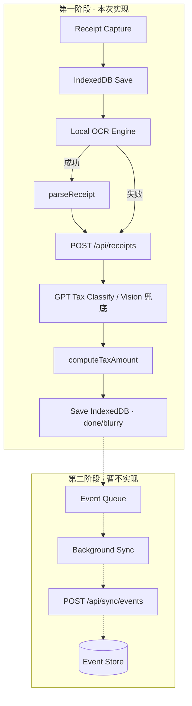
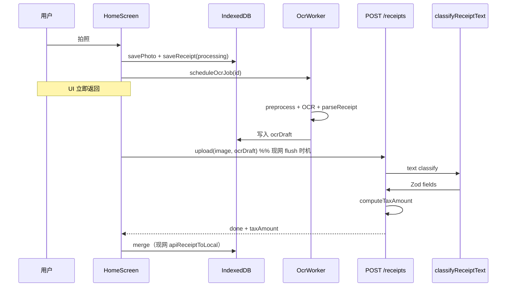
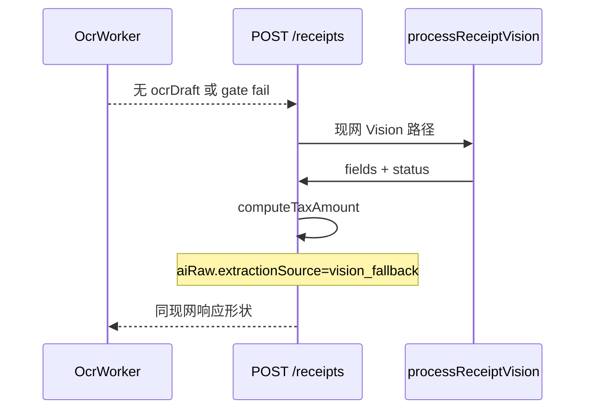

# 11 — OCR 流水线技术设计（本地 OCR + GPT 分类 + Vision 兜底）

> **状态：** 已批准（设计）· **实现：** O0–O3 已落地（2026-06-19）  
> **产品来源：** [`docs/ocr/ocr-desn.md`](../ocr/ocr-desn.md)  
> **英文摘要 spec：** [`2026-06-19-ocr-pipeline-redesign-design.md`](../superpowers/specs/2026-06-19-ocr-pipeline-redesign-design.md)  
> **关联（第一阶段）：** [`06-receipt-ai-pipeline.md`](./06-receipt-ai-pipeline.md)  
> **关联（第二阶段，暂不实现）：** [`2026-06-19-receipt-lifecycle-sync-redesign-design.md`](../superpowers/specs/2026-06-19-receipt-lifecycle-sync-redesign-design.md)

## 文档说明

本文是 **OCR 双路径** 的详细技术设计（中文）。UI 层 **不做任何修改**——用户仍只见 `processing` / `done` / `blurry`。

### 范围划分（重要）

| 阶段 | 范围 | 本文章节 |
|------|------|----------|
| **第一阶段（本次实现）** | 本地 OCR Worker、`parseReceipt`、`qualityGate`、服务端 `processReceiptTax` 路由器、`classifyReceiptText`、Vision 兜底、客户端 `ocrDraft` 与现有 upload/sync **沿用现网** | §1–§4.2、§6–§15（不含事件/API 同步） |
| **第二阶段（数据一致性，暂不设计实现）** | Event Queue、Background Sync batch、`POST /api/sync/events`、Postgres Event Store、WorkerSession 与 [sync 重设计](../superpowers/specs/2026-06-19-receipt-lifecycle-sync-redesign-design.md) 合并 | §16 路线图 |

`ocr-desn.md` 全链路架构图 **仍为产品终态**；第一阶段只交付图中 **Capture → IDB → Local OCR → Structured Receipt → GPT Classify → Deduction → IDB Save** 段，**不** 引入事件队列与 Event Store。

**第一阶段已锁定：**

1. **本地 OCR 失败** → `processReceiptVision`（与现网完全一致）。
2. `tax_amount` 仍仅经服务端 **`computeTaxAmount`**。
3. 小票 **上传 / merge / LWW / pendingUpload** 继续走 **现有** `receiptSyncOrchestrator`（不改为事件溯源）。

---

## 1. 背景与目标

### 1.1 现状问题

| 问题 | 影响 |
|------|------|
| 100% 服务端 Vision | 成本高、延迟大、每张票都传图 token |
| 无客户端 OCR | 离线仅有 IDB 行，无结构化草稿 |
| OCR 与税务分类耦合在单次 Vision | 难以单测、难以分路径优化 |

（事件链、1.5 年审计载体 → **第二阶段**，见 §16。）

### 1.2 第一阶段目标

| 维度 | 目标 |
|------|------|
| 体验 | 拍照 <100ms 返回；在线清晰小票 P50 达 `done` 0.8–1.5s |
| 成本 | ~90% 本地 OCR + 文本 GPT-mini；Vision 占比 1–5% |
| 离线 | 本地 OCR + `ocrDraft` 可写 IDB；不调 OpenAI 直至联网 |
| 兼容 | Vision 兜底与现网 parity；旧客户端仅传图仍可用 |
| UI | **零变更**（无新状态、无 Modal） |

### 1.3 第一阶段非目标

- 列表 / TaxHeader / Snap **UI** 改版
- 1099-NEC/K 文档流
- **Event Queue / Event Store / `/api/sync/events`**
- **sync 重设计**（done 锁、50 窗口、WorkerSession 模块）——第二阶段
- 改变现网 **row upsert + LWW merge** 语义

---

## 2. 第一阶段端到端流程

与 `ocr-desn.md` 前半段对齐；**虚线框为第二阶段**，本次不实现。



### 2.1 双路径（Path A / Path B）

```text
Path A（约 90%）:
  客户端 OCR → parseReceipt → 上传 image + ocrDraft
  → 服务端 classifyReceiptText（无图）
  → computeTaxAmount → 回写 IDB

Path B（约 1–5%）:
  本地 OCR 失败 / quality gate 不通过 / 文本分类失败
  → 服务端 processReceiptVision（现网完整路径）
  → computeTaxAmount → 回写 IDB（**现网** merge 路径）
```

上传时机：**沿用现网**——`flushPendingUploads`、`ProcessingReceiptWatcher`、`online` 触发等，不在第一阶段引入新 sync 门控。

### 2.2 运行时归属

| 步骤 | 运行时 | 阻塞快门 |
|------|--------|----------|
| Capture + IDB Save | 客户端主线程 | 否（<100ms） |
| **compressReceiptImage** | 客户端（capture 后） | 否（1280/q75，见 [`12-local-image-storage-design.md`](./12-local-image-storage-design.md)） |
| Local OCR | Web Worker | 否 |
| parseReceipt | Worker 或主线程纯函数 | 否 |
| Upload + Classify + Deduction | 服务端 | 否 |
| IDB merge | 客户端 | 否（**现网** `apiReceiptToLocal`） |

---

## 3. UI 契约（冻结）

对外 **仅** 使用现有 `ReceiptStatus`：

```typescript
// lib/types.ts — 不扩展
type ReceiptStatus = "processing" | "done" | "blurry";
```

| 用户所见 | 内部阶段（仅调试，不写事件表） |
|----------|----------------------------------|
| `Processing...` | 本地 OCR 进行中 / 等待 upload+分类 |
| `done` / 各桶 | 服务端分类完成并已 merge |

**禁止：** 新增 RAW、OCR_DONE、SYNCED 等 UI 文案或 Filter Tab。

---

---

## 4. 类型与数据模型

### 4.1 核心 TypeScript 类型（新建 `lib/ocr/types.ts`）

```typescript
/** 本地 OCR 引擎输出 */
export type LocalOcrResult = {
  text: string;
  confidence: number; // 0–1
  engine: "onnx" | "tesseract" | "skipped";
  durationMs: number;
};

/** parseReceipt 输出 + 质量信号 */
export type ParsedReceiptDraft = {
  merchant?: string;
  date?: string;
  total?: number;
  tax?: number;
  rawText: string;
  signals: {
    merchantMissing: boolean;
    totalMissing: boolean;
    garbleRatio: number;
  };
};

/** 上传携带的 OCR 草稿 */
export type OcrDraftPayload = {
  text: string;
  confidence: number;
  parsed: ParsedReceiptDraft;
  engine: LocalOcrResult["engine"];
  preprocessVersion: 1;
};

/** 两路径汇合后的结构化小票（分类前） */
export type StructuredReceipt = {
  merchant: string;
  date?: string;
  total: number;
  tax?: number;
  rawText: string;
  extractionSource: "local_ocr" | "vision_fallback";
};
```

> **第二阶段** 再引入 `ReceiptLifecycleEvent` 类型与 `snaptax_receipt_events` IDB store（见 §16）。

### 4.2 StoredReceipt 扩展（第一阶段 · 无 IDB 大版本迁移）

在现有 `StoredReceipt` 上增加 **可选字段**；**不** 新建 `snaptax_receipt_events` store，**不** 升级 `DB_VERSION`（除非 TypeScript 序列化需要，仍写回 `snaptax_receipts` store）：

```typescript
export interface StoredReceipt extends Receipt {
  ocrDraft?: OcrDraftPayload;
  /** 可选：服务端 ai_raw 镜像 + 本地调试 */
  aiRaw?: {
    extractionSource?: "local_ocr" | "vision_fallback";
    ocrEngine?: string;
    classificationModel?: string;
  };
}
```

服务端 `snaptax_receipts.ai_raw` 扩展（**无新表**）：

```json
{
  "extractionSource": "local_ocr",
  "ocrDraft": { "confidence": 0.89, "engine": "onnx" },
  "classificationModel": "gpt-4o-mini"
}
```

`/process` 重试可读 `ai_raw.ocrDraft` 摘要，无需客户端事件队列。

---

## 6. 模块设计（第一阶段）

### 6.1 目录结构

```text
lib/
  ocr/
    types.ts
    parseReceipt.ts
    qualityGate.ts
    preprocessImage.ts
  workers/
    ocrWorker.ts
    ocrWorkerProtocol.ts
  client/
    scheduleOcrJob.ts          # OCR 作业队列 only
  openai/
    classifyReceiptText.ts
    prompts/usClassify.ts
    prompts/euClassify.ts
  receipts/
    processReceiptTax.ts       # 改造：路由器
    processReceiptTaxRouter.ts   # 纯函数，可单测

app/api/receipts/route.ts      # 接受 ocrDraft（扩展 body）
```

**第一阶段不包含：** `receiptEventQueue.ts`、`flushEventBatch.ts`、`app/api/sync/events/`、Prisma 事件表。

**不修改（UI）：** `ReceiptListCard`、`ReceiptCaptureSection`、i18n 状态文案。

**改造接入点：** `HomeScreen.handleCapture` / `handleBatchShot` → `scheduleOcrJob(id)`；`flushPendingUploads` 附带 `ocrDraft`。**不** 增加 `appendEvent` / `flushEventBatch`。

### 6.2 本地 OCR Worker

#### 6.2.1 预处理

| 参数 | 值 | 环境变量 |
|------|-----|----------|
| 长边上限 | 1280px | `NEXT_PUBLIC_OCR_MAX_EDGE` |
| JPEG 质量 | 0.70 | `NEXT_PUBLIC_OCR_JPEG_QUALITY` |

Phase 1 不裁剪 ROI；Phase 1.1 可对宽高比 >2:1 做中心 85% 裁剪。

#### 6.2.2 引擎优先级

1. **ONNX Runtime Web** + 收据 OCR 模型（`/public/ocr/model.onnx`）
2. **Tesseract.js** `eng`（ONNX 初始化失败）
3. **skipped**：`deviceMemory <= 2` 或队列深度 > 3

模型 **lazy load**：首屏 paint 之后 `requestIdleCallback` 预加载；**不得**阻塞 Phase 0 启动（≤1.5s 可拍）。

#### 6.2.3 Worker 协议

```typescript
// main → worker
type OcrWorkerRequest = {
  kind: "run";
  receiptId: string;
  imageBlob: Blob;
};

// worker → main
type OcrWorkerResponse =
  | { kind: "ok"; receiptId: string; result: LocalOcrResult; parsed: ParsedReceiptDraft }
  | { kind: "err"; receiptId: string; reason: string };
```

主线程收到 `ok` 后：`saveReceipt({ ...row, ocrDraft })`；若在线则走 **现网** upload 调度（与 OCR 完成顺序无关，不阻塞快门）。

### 6.3 parseReceipt（纯函数）

**US 优先规则：**

| 字段 | 规则 |
|------|------|
| total | 末行匹配 `TOTAL|AMOUNT DUE|BALANCE`；取 `$`/`€` 金额 |
| merchant | 首条有效非空行（排除电话/日期行） |
| date | 顶部 `\d{1,2}/\d{1,2}/\d{2,4}` |
| garbleRatio | 非可打印字符占比 |

单元测试：`lib/ocr/parseReceipt.test.ts`（.fixture 文本样例 ≥20）。

### 6.4 qualityGate

进入 **Vision 兜底**（跳过文本分类）当 **任一** 成立：

```typescript
export function shouldUseVisionFallback(draft: OcrDraftPayload | null | undefined): boolean {
  if (!draft) return true;
  if (draft.engine === "skipped") return true;
  if (draft.confidence < 0.6) return true;
  if (draft.parsed.signals.merchantMissing) return true;
  if (draft.parsed.signals.totalMissing) return true;
  if (draft.parsed.signals.garbleRatio > 0.5) return true;
  return false;
}
```

### 6.5 服务端路由器 `processReceiptTax`

**唯一省税入口不变**（[`06-receipt-ai-pipeline.md`](./06-receipt-ai-pipeline.md)），内部扩展：

```typescript
export async function processReceiptTax(params: {
  receiptId: string;
  dataRegion: TaxRegion;
  imageBuffer: Buffer;
  mime: "image/jpeg" | "image/png";
  industry?: string | null;
  ocrDraft?: OcrDraftPayload | null;
  canMockAi?: boolean;
}): Promise<VisionProcessResult> {
  if (!params.canMockAi && shouldUseVisionFallback(params.ocrDraft)) {
    return runVisionPath(params); // 现有 processReceiptVision + computeTaxAmount
  }
  try {
    const structured = ocrDraftToStructured(params.ocrDraft!);
    const classified = await classifyReceiptText({ structured, dataRegion, industry });
    return toVisionProcessResult(classified, { extractionSource: "local_ocr" });
  } catch {
    return runVisionPath(params);
  }
}

async function runVisionPath(params): Promise<VisionProcessResult> {
  // 完全复用 lib/openai/receiptVision.ts
  // prepareVisionImage 参数不改（1568/q82）
  // 标记 aiRaw.extractionSource = "vision_fallback"
}
```

### 6.6 classifyReceiptText（Path A）

- **模型：** `gpt-4o-mini`（`OPENAI_CLASSIFY_MODEL` 可覆盖）
- **输入：** JSON 文本（StructuredReceipt + industry + data_region）
- **输出 Zod：** 复用 `UsReceiptAiSchema` / `EuReceiptAiSchema`
- **Prompt：** 新建 `usClassify.ts` / `euClassify.ts`——从 Vision prompt **拆出** Schedule C / 抵税判断，**不含** image_url

日志：`module=biz.ocr stage=text_classify`。

### 6.7 Vision 兜底（Path B）

**硬性要求：** 调用现有 `processReceiptVision`，不得 fork prompt 或降低 `prepareVisionImage` 参数。

与现网 parity 测试：同一组失败 OCR 样本，redesign 前后 `status` / `taxAmount` / bucket 一致。

---

## 7. API 设计（第一阶段）

### 7.1 `POST /api/receipts`（扩展）

**请求：** 现有 multipart + 可选 JSON 字段 `ocrDraft`（stringified）。

| 客户端 payload | 服务端行为 |
|----------------|------------|
| 仅 image | `processReceiptVision`（100% 现网） |
| image + ocrDraft 且 gate 通过 | `classifyReceiptText` → 失败则 Vision |
| image + ocrDraft 且 gate 失败 | 直接 Vision |

**响应：** 不变（201 + `serializeReceipt` 或 `processFailed`）。参见 [pipeline resilience spec](../superpowers/specs/2026-06-07-receipt-pipeline-resilience-design.md)。

**服务端持久化：** 成功后将 `ocrDraft` 摘要写入 `ai_raw.ocrDraft` 供 `/process` 重试。

### 7.2 `POST /api/receipts/:id/process`

| 条件 | 行为 |
|------|------|
| 已 `done` / `blurry` | 幂等返回（现网） |
| 有 `ai_raw.ocrDraft` 且 gate 通过 | 先 text classify，失败 Vision |
| 否则 | Vision |

> **`POST /api/sync/events`** — **第二阶段**，见 §16。

---

## 8. 时序图（第一阶段）



### 8.2 Path B — OCR 失败，Vision 兜底



### 8.3 离线拍照

```text
saveReceipt(processing) → Worker OCR → ocrDraft 写 IDB（无 OpenAI）
联网后：现网 flushPendingUploads → classify/vision → merge
```

---

## 9. 与现有代码集成（第一阶段）

| 现有模块 | 集成方式 |
|----------|----------|
| `HomeScreen.handleCapture` | + `scheduleOcrJob`；**不** await OCR |
| `handleBatchShot` | OCR 队列 FIFO；upload 仍按现网 batch Done 逻辑 |
| `flushPendingUploads` | multipart 增加 `ocrDraft` 字段 |
| `mergeServerReceiptsIntoLocal` | **不变**（LWW / pendingUpload 现网语义） |
| `ProcessingReceiptWatcher` | **不变**；服务端 router 决定 text vs vision |
| `receiptSyncBudget` | **不变** |
| `computeTaxAmount` | **唯一** tax 写入口 |

**不引入：** `workerSession.ts`、事件 flush、done 锁（均属第二阶段 sync 重设计）。

---

## 10. 环境变量

| 变量 | 默认 | 说明 |
|------|------|------|
| `NEXT_PUBLIC_SKIP_LOCAL_OCR` | （未设） | 设为 `1` 时 **跳过** 客户端 Tesseract；拍照后直接 upload → 服务端 Vision/文本分类（Path B）。**仅本地桌面调试**；生产勿开 |
| `NEXT_PUBLIC_OCR_MAX_EDGE` | 1280 | 客户端 OCR 预处理长边上限（px） |
| `NEXT_PUBLIC_OCR_JPEG_QUALITY` | 0.7 | 客户端 JPEG 质量 |
| `OPENAI_CLASSIFY_MODEL` | gpt-4o-mini | Path A 文本分类 |
| `RECEIPT_VISION_*` | 现网 | Vision 兜底 **不修改** |
| `RECEIPT_CONFIDENCE_THRESHOLD` | 0.7 | ready 下限 |
| `RECEIPT_ACTION_THRESHOLD` | 0.5 | blurry 上限 |

实现：`lib/ocr/runLocalOcr.ts`（skip 门控）· `lib/ocr/preprocessImage.ts`（`OCR_MAX_EDGE`）。

### 10.1 本地桌面调试（推荐写入 `.env.local`）

桌面浏览器无真机相机、Tesseract 冷启动首张常需 30–60s，调试 upload / Vision 链路时建议：

```bash
# 跳过本地 OCR，直接 upload → 服务端 Vision（桌面调试最快）
NEXT_PUBLIC_SKIP_LOCAL_OCR=1

# 或保留本地 OCR 但缩小输入（默认长边 1280）
NEXT_PUBLIC_OCR_MAX_EDGE=960
```

| 组合 | 行为 | 适用 |
|------|------|------|
| 默认（均不设） | Worker OCR → 有 `ocrDraft` 时 Path A 文本分类 | 真机 / 离线 / 验收 Path A |
| `SKIP_LOCAL_OCR=1` | 无 `ocrDraft`；upload 后服务端 Vision 或 classify | **桌面** 快速验 `POST /api/receipts` |
| `OCR_MAX_EDGE=960` | 仍跑本地 OCR，预处理更小、略快 | 需测 Path A 但想缩短 Worker 时间 |

与 upload 限流配合见 [09-deployment-vercel.md §9.7](./09-deployment-vercel.md#97-本地开发)（`RECEIPT_GHOST_HOURLY` 等）。改 `NEXT_PUBLIC_*` 后须 **重启** `npm run dev`。

---

## 11. 错误处理

| 场景 | 行为 | UI |
|------|------|-----|
| Worker OCR 异常 | 无 ocrDraft；upload 走 Vision | 仍 Processing → done/blurry |
| classifyReceiptText 失败 | 同请求内 Vision | 同上 |
| Vision 超时 | `processFailed`；watcher 重试 | 现网 |
| 离线 | IDB + 本地 OCR | Processing |

**禁止：** OCR 失败弹 Modal 或阻塞快门。

---

## 12. 观测与日志

扩展现有单行日志（[`snap1099-logging.mdc`](../../.cursor/rules/snap1099-logging.mdc)）：

```text
module=biz.ocr stage=local_ocr|text_classify|vision_fallback receiptId=… durationMs=… engine=… extractionSource=…
```

**指标（实现后）：**

| 指标 | 目标 |
|------|------|
| Vision 占比 | 1–5% |
| P50 time-to-done（在线） | 0.8–1.5s |
| 离线 OCR 可解析 total 比例 | >80% |
| 均摊 OpenAI 成本/票 | < $0.01 |

---

## 13. 测试策略

| 层级 | 范围 |
|------|------|
| 单元 | `parseReceipt`、`qualityGate`、`processReceiptTaxRouter` |
| 合约 | Path B 与 legacy Vision parity |
| 集成 | `POST /receipts` 带/不带 `ocrDraft` |
| E2E（可选） | 离线连拍 → 联网 → done；不测 UI 文案变化 |

**必跑：** `npm run test:unit` · `npm run build`

---

## 14. 分阶段交付

### 14.1 第一阶段（本次 · 仅 OCR）

| 步骤 | 交付物 | Vision 占比 |
|------|--------|-------------|
| **O0** | `ai_raw.extractionSource` + `biz.ocr` 日志 | ~100% |
| **O1** | 服务端 router + `classifyReceiptText`；客户端仍只传图 | ~100% |
| **O2** | Worker OCR + `ocrDraft` 上传 + 客户端 IDB 字段 | 1–5% |
| **O3** | ROI 裁剪、EU `parseReceipt` 规则 | 1–5% |

**建议上线顺序：** O0 → O1（可灰度 router）→ O2。**数据同步语义不变。**

### 14.2 第二阶段（数据一致性 · 暂不实现）

与 [`2026-06-19-receipt-lifecycle-sync-redesign-design.md`](../superpowers/specs/2026-06-19-receipt-lifecycle-sync-redesign-design.md) 合并推进：

| 交付物 | 说明 |
|--------|------|
| IDB `snaptax_receipt_events` + append 事件 | RECEIPT_CREATED / OCR_COMPLETED / TAX_CALCULATED |
| `POST /api/sync/events` + Prisma Event Store | batch 50、append-only |
| `WorkerSession` 门控 | 与 upload flush 统一 |
| done 锁、50 窗口、18 月 prune | sync 重设计全文 |

第一阶段代码 **须预留扩展点**（`ocrDraft` 结构稳定、`extractionSource` 可观测），但 **不得** 半成品事件表阻塞 OCR 上线。

---

## 15. 第一阶段验收标准

1. UI 与现网一致（无新 Modal / 状态）。
2. 连拍 10 张：IDB <100ms/张；Worker 不阻塞快门。
3. 离线 5 张：有 `ocrDraft` 或 skipped；无 OpenAI。
4. 在线清晰小票：Path A，`extractionSource=local_ocr`。
5. OCR 失败：Path B 与 legacy Vision **parity**。
6. `tax_amount` 仅来自 `computeTaxAmount`。
7. **现网** merge / pendingUpload / watcher 行为无回归。
8. WASM lazy load；loader gzip <150KB。

~~事件链、Background sync、Event Store~~ → 第二阶段。

---

## 16. 第二阶段路线图（数据一致性 · 摘要）

完整规范见 sync 重设计 spec + `ocr-desn.md` §11–§12。实现时再更新本文 §4.3 / §5 全文。

```text
IDB Save → … → TAX_CALCULATED
  → Event Queue (`snaptax_receipt_events`)
  → Background Sync (online && !WorkerSession)
  → POST /api/sync/events (batch 50)
  → Postgres Event Store (append-only, 18mo)
```

与第一阶段 OCR 的衔接：在 `saveReceipt(done|blurry)` 之后 **追加** 事件写入，不改动 router / Vision 兜底逻辑。

---

## 17. 文档变更清单（第一阶段实现时）

| 文档 | 变更 |
|------|------|
| `docs/tech/06-receipt-ai-pipeline.md` | 双路径、router；**不**写 Event Store |
| `docs/tech/03-api.md` | `ocrDraft` 字段 |
| `docs/product/PRODUCT-SPEC.md` §2.3.1 | 在线分类 + Vision 兜底 |
| `docs/tech/DB-DESIGN-SPEC.md` §2.2 | IDB store `snaptax_*` 命名（v5 迁移） |
| `docs/tech/12-local-image-storage-design.md` | OPFS + 压缩 + 90d 回收（OCR 输入用压缩 full） |

~~`04-data-model` 事件表~~ → 第二阶段。

---

## 18. 参考

- 产品 OCR 终态：[`docs/ocr/ocr-desn.md`](../ocr/ocr-desn.md)
- **第二阶段** sync / 一致性：[`2026-06-19-receipt-lifecycle-sync-redesign-design.md`](../superpowers/specs/2026-06-19-receipt-lifecycle-sync-redesign-design.md)
- Pipeline 韧性：[`2026-06-07-receipt-pipeline-resilience-design.md`](../superpowers/specs/2026-06-07-receipt-pipeline-resilience-design.md)
- 置信度三档：[`2026-06-17-home-v2-first-screen-design.md`](../superpowers/specs/2026-06-17-home-v2-first-screen-design.md)
